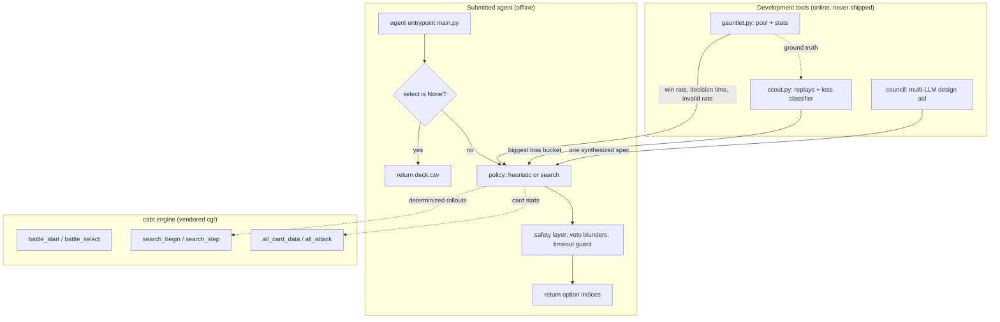
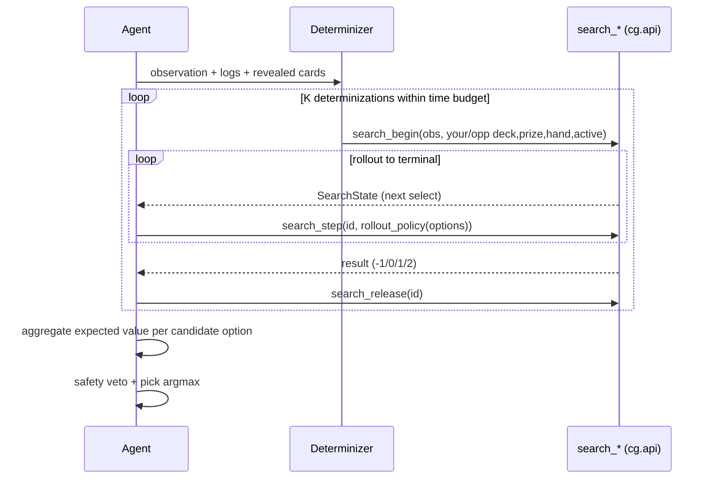

# feat: Pokemon TCG AI Battle Challenge agent (cabt Engine)

## Summary

Build an AI agent that plays the Pokemon Trading Card Game on Kaggle's cabt Engine and ranks well on the Simulation ladder, while keeping the approach novel and explainable so it can place top 8 in the paired Strategy category (the $30k-per-team prize). The work proceeds in gated phases: a legal-move baseline, a rules-aware heuristic, a determinized-lookahead search agent that drives the engine's own forward model, then targeted edges chosen by loss data, a two-deck portfolio, and a Strategy writeup. Every change is scored against a gauntlet of opponents before it is kept. A council of LLMs is a design aid only; the simulator decides by measured win rate. The submitted agent runs fully offline.

All six pre-build unknowns are resolved against ground truth (engine source and the official SDK download), not documentation. The findings are captured in the Ground-Truth Findings section and drive the Key Technical Decisions.

---

## Problem Frame and Goal

- **Two linked competitions.** Simulation (the head-to-head ladder, slug `pokemon-tcg-ai-battle`, final submission 16 Aug 2026) and Strategy (slug `pokemon-tcg-ai-battle-challenge-strategy`, final 13 Sept 2026). Entry into Simulation is required to be eligible for Strategy. Dan is already entered in both.
- **What wins.** Strategy is scored 70% model approach, 20% deck concept, 10% writeup. The target is top 8 Strategy, not necessarily number 1 on the raw ladder. So the agent must be strong AND the method must be defensible and original.
- **Hard constraints.** No em dashes in any code, comment, doc, or output. Competition data stays isolated at `C:\Users\danom\ptcg-abc` (outside OneDrive, never redistributed). The submitted agent runs fully offline (no network or LLM calls at match time).
- **The real first gate is 16 Aug**, not September: a competitive Simulation submission must be in by then to keep Strategy eligibility and to have a rating worth writing about.

---

## Ground-Truth Findings (verified during recon)

These are confirmed from the installed engine (`kaggle_environments/envs/cabt/`) and the official competition download (`sample_submission/cg/api.py`, `main.py`, `deck.csv`, `EN_Card_Data.csv`), plus live local measurement.

1. **Observation.** The agent receives a dict shaped like `Observation`: `select` (the current decision, `None` only at deck selection), `logs` (events since the last decision), `current` (the `State`), and `search_begin_input` (an opaque string consumed by the forward model). `State` carries `turn`, `turnActionCount`, `yourIndex`, `firstPlayer`, the per-turn flags `supporterPlayed`/`stadiumPlayed`/`energyAttached`/`retreated`, `result` (-1 ongoing, 0 player0 wins, 1 player1 wins, 2 draw), `stadium`, and `players[2]`. Opponent `hand` is `None` and hidden `prize`/face-down cards are `None`; counts (`deckCount`, `handCount`, `prize` length) are visible. Convert with `to_observation_class(obs_dict)` from `cg.api`.

2. **Action.** Return `list[int]`: indices into `obs.select.option`, length between `minCount` and `maxCount` inclusive, no duplicates, each `0 <= i < len(option)`. At deck selection (`select is None`) return the 60 card IDs. Options are typed by `OptionType` (PLAY, ATTACH, EVOLVE, ABILITY, DISCARD, RETREAT, ATTACK, END, plus card/energy/number/yes-no selectors), so a heuristic filters by type and the engine never hands an illegal move.

3. **Run a local match.** `env = make("cabt", configuration={"decks":[d0,d1]}); env.run([a,b])`. Two reference agents ship in the engine (`random_agent`, `first_agent`). Verified: ran 60 matches clean.

4. **Submission.** `submission.tar.gz` with `main.py` + `deck.csv` (60 IDs, one per line) + the `cg/` package at top level. Entrypoint is module-level `def agent(obs_dict: dict) -> list[int]` (not a class, not `agent(obs, config)`). `main.py` loads the deck from `deck.csv`, falling back to `/kaggle_simulations/agent/deck.csv`. Submit via `kaggle competitions submit pokemon-tcg-ai-battle -f submission.tar.gz -m "msg"`. Five submissions per day, latest two scored, TrueSkill-style 1v1 skill rating.

5. **Time budget.** `cabt.json` sets `actTimeout: 0` (no per-move cap) and `runTimeout: 2000` (seconds per episode), and the env observation carries `remainingOverageTime: 600`, a 600-second cumulative thinking bank per player per match. Budget search against the bank with a per-move soft cap and a hard timeout guard; do not assume a tight per-move limit.

6. **Simulator speed (measured locally).** Raw `battle_select` loop: about 5,357 selects/sec, 187 microseconds per select, ~65 full games/sec, ~82 decisions per game. The `env.run` wrapper path is ~2.5 matches/sec (overhead dominated). The engine core is a native library (`cg.dll` on Windows, plus `.so`/`.dylib`).

7. **Forward model is officially provided.** `cg/api.py` exposes `search_begin(observation, your_deck, your_prize, opponent_deck, opponent_prize, opponent_hand, opponent_active)`, `search_step(search_id, select)`, `search_end()`, `search_release(search_id)`, plus `all_card_data()` and `all_attack()`. `search_begin` takes the determinized hidden state as input and validates it against the observed counts. This means determinized lookahead uses the engine's exact rules at native speed; we do not reimplement the game in Python.

8. **Everything runs offline on this machine.** The engine, a legal sample deck, the card database, and the full SDK are all local. The Kaggle token (new single-token auth at `~/.kaggle/access_token`, not the legacy `kaggle.json`) is only needed to submit, scout replays, and refresh official data.

---

## Key Technical Decisions

### KTD1. Drive the engine's provided `search_*` forward model rather than reimplement the rules in Python.
`cg/api.py` ships `search_begin`/`search_step` backed by the native core. This removes the largest risk in the original Phase 4a (a hand-written `fast_sim.py` that must match engine rules exactly). Our forward model is a thin driver plus a determinization sampler and a rollout policy. `fast_sim.py` as a from-scratch rules engine is dropped; if a faster-than-native model is ever needed it would be a late, optional optimization.

### KTD2. Budget search against the 600-second cumulative bank, not a fixed per-move limit.
`actTimeout: 0`, `remainingOverageTime: 600`. Spend little on forced or trivial decisions, spend more on pivotal ones, and keep a hard guard so cumulative time never approaches 600s (timeout is an automatic loss). A per-move soft cap is a tuning parameter, not a contract.

### KTD3. The submitted agent is fully offline and deterministic-enough to never crash.
No network, no LLM calls at match time. The council and scout are development-time tools. Every agent path ends in a guaranteed legal fallback (worst case: a legal random option, or `END`), because a single exception forfeits the match.

### KTD4. Treat the engine as a process-global singleton; parallelize matches across processes.
The native battle state lives in a module global (`Battle.battle_ptr`), so two matches cannot run in one process. The gauntlet runs one match per worker process via multiprocessing to get throughput.

### KTD5. Optimize for low-variance win/loss, not margin.
The rating is margin-independent. Avoiding bad losses (missed lethal, careless deck-out, timeout) beats chasing blowouts. A safety layer sits above search to veto blunders.

### KTD6. Vendor the official `cg/` package and submit it with the agent.
`api.py` needs the matching `sim.py` ctypes restypes to read `AllCard`/`SearchBegin` return values. Bundling the official `cg/` (already downloaded to `data/cg/`) guarantees the forward model and card database at runtime and pins behavior to the scored engine.

### KTD7. One submission carries one deck; develop two, submit the stronger, discuss both in the writeup.
A submission includes a single `deck.csv`. The two-deck portfolio (Phase 5) is a Strategy concept and a development hedge: we build an aggro/consistency deck and a control/prize-denial deck, measure them against the field, and submit whichever scores better, presenting the pair and the matchup logic in the writeup.

### KTD8. Defend against enum drift.
`api.py` warns that enum members may be appended during the competition. Option/select handling keys on known `OptionType`/`SelectType` values and treats unknown values as a safe pass (legal fallback) rather than crashing.

---

## High-Level Technical Design

Components and how they relate:



The search decision loop at a single MAIN decision:



The pseudo-code below is directional, not an implementation spec:

```
decide(obs):
    if obs.select is None: return load_deck()
    legal = obs.select.option
    if only one legal choice: return it
    if heuristic finds lethal/forced: return it            # KTD5 safety-first
    budget = timebudget.allot(obs, bank_remaining)         # KTD2
    scores = zeros(len(candidate_options))
    while time_spent < budget:
        d = determinize(obs, beliefs)                      # sample hidden zones
        for opt in candidate_options:
            scores[opt] += rollout(search_begin(obs, d), first=opt)
    return safety_veto(argmax(scores), obs)                # KTD5
```

---

## Output Structure

Greenfield layout in the `ptcg-abc` repo (the venv, `data/`, and downloaded SDK already exist from recon):

```
ptcg-abc/
  src/ptcg_agent/
    __init__.py
    engine.py            # thin wrapper over cg.api + kaggle_environments make
    observation.py       # typed helpers over Observation/State/Option
    cards.py             # card DB access (all_card_data + EN_Card_Data.csv)
  agents/
    agent_baseline.py
    agent_heuristic.py
    agent_search.py
    heuristics.py        # option classification + rule helpers
  search/
    determinize.py       # sample hidden zones consistent with logs + counts
    rollout.py           # search_* driver + rollout policy
    eval.py              # state value (prizes, board, energy, HP)
    timebudget.py        # draw down the 600s bank
    endgame.py           # deeper search when state space is small
  analysis/
    archetype.py         # opponent deck-archetype identification
    loss_classifier.py   # bucket losses from replays
    deck_design.md
  decks/
    baseline.csv aggro.csv control.csv
  tools/
    local_match.py gauntlet.py opponents.py build_submission.py
    scout.py deck_validate.py
  council/
    orchestrator.py providers.py prompts/
  submission/            # built artifact staging: main.py + deck.csv + cg/
  vendor/cg/             # the official engine package (from data/cg/)
  data/                  # isolated competition data (gitignored, never redistributed)
  tests/
  writeup.md
  docs/plans/
```

The per-unit Files lists are authoritative; this tree is the intended shape.

---

## Implementation Units

### U1. Project scaffold, vendored engine, and offline match harness
- **Goal:** a runnable package skeleton, the official `cg/` vendored, and a `local_match` helper that runs agent vs agent and returns result plus stats.
- **Dependencies:** none (recon already produced the venv and downloaded `cg/` to `data/cg/`).
- **Files:** `src/ptcg_agent/__init__.py`, `src/ptcg_agent/engine.py`, `src/ptcg_agent/observation.py`, `src/ptcg_agent/cards.py`, `vendor/cg/` (copied from `data/cg/`), `tools/local_match.py`, `tests/test_harness.py`, `.gitignore` (excludes `data/`, `*.tar.gz`, venv).
- **Approach:** `engine.py` exposes `make_env`, `run_match(agent_a, agent_b, seed, swap_first)`, and a typed-observation helper via `cg.api.to_observation_class`. `cards.py` loads `all_card_data()` at import and indexes by `cardId`, cross-checked against `EN_Card_Data.csv`. Keep `data/` isolated and gitignored.
- **Patterns to follow:** mirror the official `main.py` deck-loading and the engine's `random_agent`/`first_agent` shape.
- **Test scenarios:** harness runs a full match end to end without error; final reward is in {-1, 0, 1}; first-player swap works; an agent that returns an out-of-range index is caught and reported, not crashed; `cards.py` returns a `CardData` for a known ID (3 = Basic Water Energy) and `None` for an unknown ID.
- **Verification:** `tools/local_match.py` prints a result and step count for `random` vs `first`.

### U2. Baseline agent and submission builder (Phase 1)
- **Goal:** an agent that returns any legal move and a valid `submission.tar.gz`.
- **Dependencies:** U1.
- **Files:** `agents/agent_baseline.py`, `decks/baseline.csv` (start from the official sample deck), `tools/build_submission.py`, `submission/main.py`, `tests/test_baseline.py`.
- **Approach:** `agent_baseline.py` mirrors the official `main.py`: deck on `select is None`, else `random.sample(range(len(options)), maxCount)`. `build_submission.py` stages `main.py` + chosen `deck.csv` + `vendor/cg/` into `submission/` and tars it.
- **Gate:** completes a local match with no errors and produces a tar that `env.run` accepts when unpacked.
- **Test scenarios:** returned indices always in range and length `maxCount` with no duplicates; deck-select returns exactly 60 valid IDs; built tarball contains `main.py`, `deck.csv`, and `cg/` at top level; unpacked submission runs a full local match.
- **Verification:** `build_submission.py` emits `submission.tar.gz`; a smoke run plays it against `random`.

### U3. Gauntlet eval harness and opponent pool
- **Goal:** score any agent against a pool over many matches with reproducible stats: win rate (with confidence interval), average and max decision time, invalid-move rate.
- **Dependencies:** U1, U2.
- **Files:** `tools/gauntlet.py`, `tools/opponents.py`, `tests/test_gauntlet.py`, `results/` (json output).
- **Approach:** one match per worker process (KTD4) via multiprocessing; alternate first player; fixed seeds per match; opponents registry holds `random`, `first`, the heuristic, and frozen snapshots of past agents. Aggregate with a Wilson interval on win rate. Self-play feedback: each kept version is added to the pool.
- **Patterns to follow:** keep the worker function importable and side-effect free so multiprocessing on Windows (spawn) works.
- **Test scenarios:** a small gauntlet returns a stats dict with all fields; decision time is recorded per move; first-player alternation is balanced; identical seed reproduces identical results; a deliberately illegal agent shows a nonzero invalid-move rate without aborting the run.
- **Verification:** `gauntlet.py baseline vs random -n 200` prints win rate, CI, timing, invalid rate.

### U4. Heuristic agent (Phase 2)
- **Goal:** attach energy each turn, evolve when able, take a knockout when available, retreat when the active is low on HP, otherwise use the best affordable attack; never crash.
- **Dependencies:** U1, U3, `cards.py`.
- **Files:** `agents/agent_heuristic.py`, `agents/heuristics.py`, `tests/test_heuristic.py`.
- **Approach:** classify `obs.select.option` by `OptionType` and `SelectContext`; use card data for HP, attack cost, and damage; compute lethal as opponent active HP minus our best affordable attack damage adjusted for weakness/resistance; respect `energyAttached`/`supporterPlayed` flags; fall back to `END`, then to a legal random option.
- **Gate:** beats the baseline above 70% over 50 matches (run 200+ via the gauntlet for a tight interval). Submit this to the Simulation ladder to get a real rating.
- **Test scenarios:** Covers F (energy) the energy-attach rule fires only when `energyAttached` is false and an ATTACH energy option exists; lethal attack is chosen when available; retreat is chosen when active HP is low and a healthy bench Pokemon exists and a non-lethal turn is forced; evolve is taken when an EVOLVE option is legal and beneficial; on a YES_NO or COUNT selection the agent returns a legal in-range choice; the agent never returns an illegal move across a 200-match gauntlet (invalid rate 0).
- **Verification:** gauntlet win rate vs baseline over 200 matches exceeds 70% with the interval clearing the gate; first ladder submission lands.

### U5. Determinized search agent (Phase 3)
- **Goal:** at each meaningful decision, sample plausible hidden opponent state, run K determinized rollouts per candidate option through `search_*`, and pick the highest expected value, all within the time bank.
- **Dependencies:** U1, U3, U4 (heuristic is the rollout and fallback policy).
- **Files:** `agents/agent_search.py`, `search/determinize.py`, `search/rollout.py`, `search/eval.py`, `search/timebudget.py`, `tests/test_search.py`.
- **Approach:** `determinize.py` samples the opponent deck, hand, prize, and face-down active so counts match the observation and revealed cards (from `logs`) are respected; `rollout.py` calls `search_begin` with that determinization, plays the candidate first move, then rolls to terminal with the heuristic policy, and reads `result`; aggregate expected value across determinizations; `timebudget.py` allots per-decision time from the remaining bank. Reuse and `search_release` states. Value is win/loss with a small prize-differential shaping for equal-result rollouts.
- **Execution note:** start with a `search_begin`/`search_step` smoke test that confirms the determinization inputs satisfy the engine's count validation (the one integration debug pass flagged in recon) before building the search loop.
- **Gate:** beats the heuristic above 60% over a few hundred matches and reports average decision time comfortably under the per-move soft cap.
- **Test scenarios:** determinization always satisfies `search_begin` validation (deck/prize/hand/active counts); a revealed opponent card is never sampled into a zone it cannot be in; rollouts reach a terminal `result`; the agent degrades to the heuristic if `search_begin` raises; total thinking time across a worst-case match stays well under 600s; argmax selection is stable under a fixed seed.
- **Verification:** gauntlet vs heuristic over 300 matches clears 60%; decision-time histogram reported.

### U6. Scout and loss classifier
- **Goal:** download our own and top teams' episodes, replays, and logs, and classify our losses into bad determinization, slow search, endgame misplay, or deck matchup, surfacing the biggest bucket.
- **Dependencies:** U3 (need a ladder agent and recorded games), working Kaggle auth.
- **Files:** `tools/scout.py`, `analysis/loss_classifier.py`, `replays/` (gitignored).
- **Approach:** wrap `kaggle competitions episodes/replay/logs` (CLI 2.2.3 confirmed; auth via `~/.kaggle/access_token`); parse replay JSON (the engine stores per-step obs and actions in `visualize_data`); per-bucket heuristics, for example flag slow-search when our decision times spike near losses, and deck-matchup when losses cluster by opponent archetype. Respect data isolation; do not redistribute downloaded replays.
- **Test scenarios:** parse a saved sample replay into per-step records; classify a synthetic loss into the right bucket; the CLI wrapper handles a missing or unauthorized episode gracefully; the report ranks buckets by frequency.
- **Verification:** `scout.py` produces a ranked loss-bucket report from a batch of our episodes.

### U7. Forward-model edge: sharpen search (Phase 4a)
- **Goal:** deeper or wider search using the provided engine, chosen if loss data says search quality is the bottleneck.
- **Dependencies:** U5, U6.
- **Files:** `search/rollout.py` (enhanced), `search/eval.py`, `tests/test_eval.py`.
- **Approach:** parallelize determinizations across worker processes, add a stronger value function from card data, cache repeated sub-states, and tune K and rollout depth to the bank. The native model is the speed floor; this unit is about using it better, not replacing it.
- **Test scenarios:** the enhanced search beats U5 head to head in the gauntlet; decision time stays bounded; the value function orders clearly winning over clearly losing constructed states correctly.
- **Verification:** gauntlet improvement over U5 with no timeout regressions.

### U8. Opponent archetype identification (Phase 4b)
- **Goal:** infer the opponent's deck archetype from revealed cards to sharpen determinization priors.
- **Dependencies:** U5, U6, `cards.py`.
- **Files:** `analysis/archetype.py`, `search/determinize.py` (prior weighting).
- **Approach:** accumulate revealed opponent cards from `logs` (PLAY, ATTACH, EVOLVE, ATTACK card IDs), match against archetype signatures built from `EN_Card_Data.csv` and observed meta, and bias the determinization sampler toward consistent decklists; fall back to uniform when unknown.
- **Test scenarios:** revealed cards update the belief toward the matching archetype; sampled determinizations always contain the revealed cards; an unrecognized opening falls back to a broad prior; belief never contradicts the visible board.
- **Verification:** determinization accuracy (sampled-deck overlap with eventual reveals) improves in replayed games; gauntlet win rate against archetype-diverse opponents improves.

### U9. Endgame solver (Phase 4c, optional, data driven)
- **Goal:** when the state space is small, search deeper toward exact play.
- **Dependencies:** U5.
- **Files:** `search/endgame.py`, `tests/test_endgame.py`.
- **Approach:** trigger on low prize counts and small hand-plus-deck; widen rollout depth or enumerate the option tree more exhaustively via `search_*` within the bank.
- **Test scenarios:** the trigger fires at the intended thresholds and not before; a constructed forced-win position is solved; the solver respects the time guard.
- **Verification:** measured reduction in endgame misplays (per the scout classifier) after enabling.

### U10. Low-variance tuning and safety layer (Phase 4d)
- **Goal:** minimize bad losses; never miss lethal, never deck-out carelessly, never time out.
- **Dependencies:** U4, U5.
- **Files:** `agents/agent_search.py` (safety wrapper), `search/timebudget.py` (hard guard), `tests/test_safety.py`.
- **Approach:** a deterministic safety layer above search that takes a known lethal, avoids self-deck-out lines, and enforces a hard cumulative-time guard so the agent always answers before the bank is at risk.
- **Test scenarios:** a guaranteed lethal is always taken even if search disagrees; a self-deck-out line is vetoed when an alternative exists; in a stress match with a low simulated bank the agent never exceeds the guard; the safety layer always returns a legal move.
- **Verification:** zero timeouts and zero missed-lethal events across a large gauntlet; loss-bucket shift away from blunders.

### U11. Two-deck portfolio (Phase 5)
- **Goal:** build an aggro/consistency deck and a control/prize-denial deck that cover the field, validate legality, and pick the stronger to submit.
- **Dependencies:** U3, U4, U5, `cards.py`.
- **Files:** `decks/aggro.csv`, `decks/control.csv`, `tools/deck_validate.py`, `analysis/deck_design.md`.
- **Approach:** construct each deck from `EN_Card_Data.csv` and observed meta; validate legality by calling `battle_start` and checking `errorPlayer == -1` plus deck-construction rules (60 cards, at most 4 copies of a non-basic-energy card, at most 1 ACE SPEC); run head-to-head and field gauntlets to confirm the rock-paper-scissors relationship; document the concept and tradeoffs.
- **Test scenarios:** each deck passes `battle_start` validation as a legal 60; the aggro deck beats the control target archetype and the control deck beats the aggro target in head-to-head; both decks run end to end with the search agent.
- **Verification:** gauntlet matrix shows the intended coverage; the stronger deck is selected for submission.

### U12. Council of models orchestrator (design aid)
- **Goal:** for hard design questions (determinization policy, rollout/eval design, deck concept), fan the same brief to several LLMs, cross-critique anonymized proposals, and synthesize one spec; the simulator then judges by win rate.
- **Dependencies:** none on the agent; used throughout development.
- **Files:** `council/orchestrator.py`, `council/providers.py`, `council/prompts/`, `tests/test_council.py`.
- **Approach:** providers for Opus/Sonnet/Haiku (Anthropic) and GPT/DeepSeek/GLM, keys read from env vars only; anonymize proposals before cross-critique; never let models vote on best; emit a spec that is validated by a gauntlet experiment. This is a dev tool and is never part of the submitted agent.
- **Test scenarios:** runs offline with mock providers; a missing API key skips that provider without failing the run; no secret is ever written to disk or logs; output is a single synthesized spec plus the anonymized critiques.
- **Verification:** a sample design question produces a synthesized spec; a follow-up gauntlet experiment is what actually decides adoption.

### U13. Strategy writeup (Phase 6)
- **Goal:** `writeup.md`, max 2000 words: how the agent decides, the deck concept, and the design tradeoffs, framed for the 70% model-approach score.
- **Dependencies:** U5, U7 to U11 (the story needs the real method and results).
- **Files:** `writeup.md`.
- **Approach:** explain the determinized-search-over-the-native-model approach, the low-variance philosophy, the archetype-aware determinization, and the two-deck concept; cite measured gauntlet and ladder results; emphasize novelty and explainability.
- **Test scenarios:** none (document). Test expectation: none -- prose deliverable. Constraint check: word count at or under 2000; covers decision procedure, deck concept, and tradeoffs.
- **Verification:** word count under 2000; a non-author can follow how the agent decides from the text alone.

---

## Scope Boundaries

**In scope:** the offline agent (baseline, heuristic, search), the gauntlet, the scout and loss classifier, the council dev tool, two decks, and the writeup, all per the phases above.

### Deferred to follow-up work
- A from-scratch Python rules engine (`fast_sim.py`). Superseded by KTD1 (the native `search_*` model). Revisit only if a faster-than-native model is ever needed.
- Learned policies or value networks (neural rollout guidance). Possible later edge once the search baseline is strong; not in the initial phases.
- Multi-deck adaptive submission (choosing a deck per opponent). A submission carries one deck; out of the engine's submission model.

### Out of scope
- Any online dependency at match time. The submitted agent is offline by constraint.
- Account automation or scraping beyond the official Kaggle API. Against competition and platform rules.
- Mixing competition data with other Pokemon projects on this machine, or redistributing it.

---

## Risks and Dependencies

- **R1. Determinization inputs are fiddly.** `search_begin` validates counts and consistency; the first integration may need a debug pass. Mitigation: U5 starts with a smoke test.
- **R2. Engine is a process singleton.** Limits per-process parallelism. Mitigation: one match per worker process (KTD4).
- **R3. Engine or auth version drift.** The pip `kaggle-environments` cabt may differ from the scored engine, and the CLI moved to single-token auth. Mitigation: vendor the official `cg/` (KTD6), pin versions, and validate the exact built submission locally before each upload.
- **R4. Enum drift mid-competition.** `api.py` warns members may be appended. Mitigation: defensive option handling (KTD8).
- **R5. Grader timeout may differ from the local 600s bank.** Mitigation: treat 600s/player as the working assumption, keep a conservative hard guard, and verify against the rules page or a probe submission.
- **R6. Windows long-path install failure.** Already hit (orbax test data). Mitigation: the lean `kaggle-environments --no-deps` install is documented and in place.
- **Dependency:** Kaggle auth and rules acceptance (done); five submissions per day pacing; the 16 Aug Simulation gate.

---

## Milestones (work back from the gates)

1. **Now to mid-July:** U1 to U4. Baseline and heuristic done, heuristic submitted to the Simulation ladder for a first rating.
2. **Mid-July to early August:** U5, U3 hardening, U6. Search agent beats heuristic; scout running.
3. **By 16 Aug (hard gate):** the strongest agent and chosen deck submitted to Simulation to lock Strategy eligibility.
4. **16 Aug to 13 Sept:** U7 to U11 driven by loss data, then U13 writeup. Final Strategy submission 13 Sept.

The council (U12) runs throughout as a design aid; the gauntlet is the arbiter at every step.

---

## Open Questions (resolve during execution)

- The grader's enforced per-player or per-move timeout versus the local 600s bank (verify on the rules page or via a probe submission).
- Whether `kaggle-environments` 1.30.1 versus 1.30.2 changes cabt behavior (diff `cabt.json` and `cg/` against the vendored copy).
- The exact deck-construction legality rules (copy limits, ACE SPEC, energy exceptions) beyond what `battle_start` validation reveals; derive from `EN_Card_Data.csv` and rules text.
- Whether revealed-card logging is rich enough for reliable archetype ID early in a match (U8 will measure).

---

## Sources and Research

- Engine source (installed): `kaggle_environments/envs/cabt/cabt.py`, `cg/game.py`, `cg/sim.py`, and `cabt.json` (timeouts, `remainingOverageTime: 600`, reward semantics).
- Official competition download (in `data/`): `sample_submission/cg/api.py` (full SDK and forward model), `main.py` (entrypoint and deck loading), `deck.csv` (legal sample deck), `EN_Card_Data.csv` (card database).
- Local measurements: 60-match `env.run` benchmark and a raw `battle_select` benchmark (5,357 selects/sec, 187 us/select); `cg.dll` export probe confirming `SearchBegin`/`SearchStep`/`AllCard`/`AllAttack`.
- Recon workflow synthesis (5 researchers): install method, scoring (TrueSkill-style, 1v1, 5/day, latest 2 scored), scouting CLI (episodes/replay/logs, kaggle-cli 2.0.2+), and the two-competition deadline structure.
- SDK docs: https://matsuoinstitute.github.io/cabt/ (corroborating, superseded by source where they differ).
