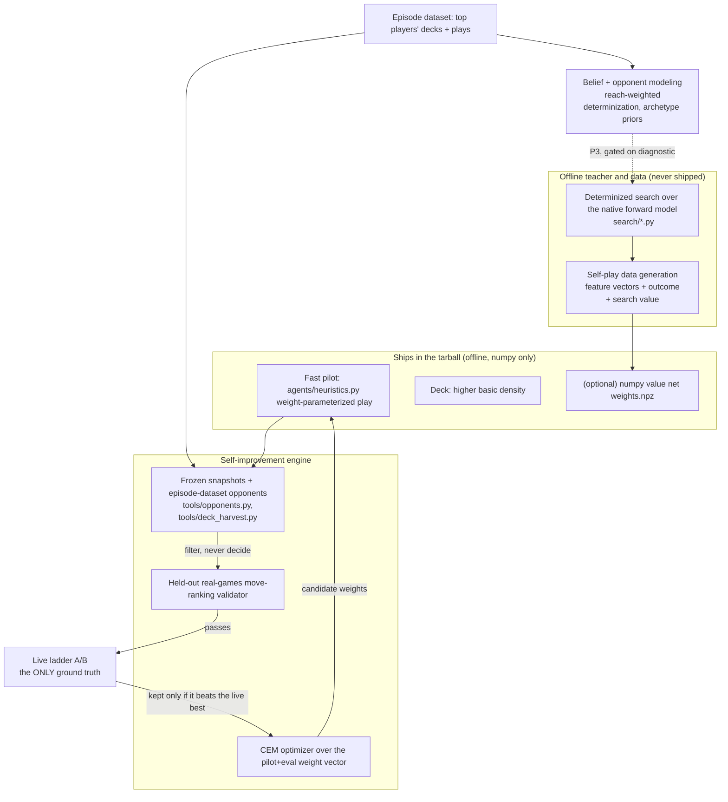

# feat: Self-improving agent to climb toward #1 (ptcg-abc)

**Target repo:** `ptcg-abc` (all paths below are relative to it).

## Summary

The goal is number 1 on the Simulation ladder via a self-improving strategy, not a one-off tuned agent. Research plus our own ladder data force a reframe: the determinized search agent, when it actually runs on the ladder, scores worse than the plain heuristic (514.7 vs 569.6 on the same deck), so the search is not the thing to optimize. It is an offline teacher. The plan builds a teacher-to-student self-improvement system: a fast heuristic pilot plays every match, an offline search oracle plus self-play generates labels and validates ideas, and a Cross-Entropy-Method optimizer tunes the pilot against the live ladder as the sole ground truth. It is sequenced so the first, highest-confidence win attacks the proven root cause (we board ourselves out 58% of games versus the top's ~10%), and the higher-ceiling, higher-risk bets (belief-weighted search revival, a learned numpy value net) come later and gated on evidence.

Honest framing up front: phases P0 to P2 will climb but likely plateau short of the top. The literal #1 is contested in P3, which is a real modeling effort gated on a diagnostic, with a tuned-heuristic fallback kept live the whole time.

---

## Problem Frame and Goal

- **Goal:** climb from ~570 toward the top of the ladder (~1300), aiming at #1, through a system that keeps improving itself (the hackathon story).
- **Proven root cause (a piloting gap, not a deck gap):** copying the top players' exact decks scored worse than our own deck (see `analysis/meta_decks_underperform_on_ladder.md`); we end games with an empty bench 58% of the time versus the top's ~10%; the empty bench is a cliff (one knockout with no bench ends the game), not the linear cost the current evaluation models.
- **The reframe that reorders everything:** on the same deck, search-active scored 514.7 while heuristic-only scored 569.6 (see `analysis/ladder_scored_pair_reclaim.md`). Running the search costs points. Every search-side lever tried so far is ladder-neutral-to-negative. So the fast heuristic is the deployable pilot; the search stack becomes an offline oracle whose job is to teach and validate.
- **Hard constraints (unchanged):** the submitted agent runs fully offline in a tarball (Python plus numpy only, no network, no GPU at match time, a few seconds per move against a 600s cumulative bank); competition data stays isolated and is never redistributed; no em dashes anywhere; the grader loads `main.py` via `exec()` with no `__file__`, the entrypoint must be the last callable defined, and the native engine is a process-global singleton.

---

## Ground-Truth Findings (what the plan is built on)

These are established from our own committed analysis and the research pass, and they are the load-bearing facts.

1. **Search is currently a net negative on the ladder.** The strongest deployable pilot is `agents/agent_heuristic.py` plus `agents/heuristics.py`, not `agents/agent_search.py`.
2. **The self-preservation feature is installed in the wrong place.** A bench cushion already exists in `search/eval.py`, but rollouts run to terminal by default, so the leaf evaluation only fires at depth-cut leaves and the term is structurally squeezed. It belongs in the pilot's move ordering, where it acts on real states every turn.
3. **The board-out floor is deck-set, not guard-set.** Widening the existing thin-bench guard alone did not move the ~40% board-out floor (see `analysis/thin_bench_threshold_is_flat.md`); the floor is set by the deck's basic-Pokemon density. The pilot term and a higher-basic deck must ship together.
4. **Offline metrics do not transfer to the ladder.** The project already lived this (strong offline, ~570 live). Only ladder A/B is ground truth; offline gauntlets vs weak built-in bots filter but never decide.
5. **The frozen, diverse opponent pool is scaffolded but empty.** `tools/opponents.py` registers only random/first/baseline/heuristic/search. Optimizing against ourselves yields a self-beater, the textbook overfit that explains ~570 live.
6. **We have a fast native forward model and a 5734-episode dataset** (including the top players' exact decks and plays), which are the two assets that make self-improvement and belief modeling feasible on CPU.

---

## Key Technical Decisions

### KTD1. Optimize the fast pilot; treat determinized search as an offline teacher, not the player.
Grounded in the 514.7-vs-569.6 ladder fact. The heuristic plays every match; the search generates training labels and validates candidate ideas offline. This converts the refuted "strengthen the search agent" direction into a teacher-to-student pipeline that can actually climb.

### KTD2. The self-preservation term lives in the pilot's move ordering and ships coupled with a higher-basic-density deck.
The bench-cushion shape in `search/eval.py` is right, but it is squeezed at depth-cut leaves. Port that shaping into `agents/heuristics.py` where it governs the develop/bench priority on real states, and pair it with a deck that has enough basics and bench-fetch for the guard to act on. Neither half moves the 58% alone.

### KTD3. Self-improve via Cross-Entropy Method over a weight vector first; add a learned numpy value net only if tuning plateaus.
Parameterize the pilot plus leaf-eval constants as one 10-to-40-number weight vector and optimize it with CEM (the reliable, tiny-to-ship choice), embarrassingly parallel across the existing gauntlet. A learned value net has more headroom but more work and risk, and is worth it only after CEM stops paying.

### KTD4. The ladder A/B is the sole arbiter; build the anti-overfit machinery before any tuning runs.
Two things gate every candidate: a frozen plus episode-dataset opponent pool (so we optimize against the real field, not ourselves), and a held-out-real-games validator (a candidate that wins in self-play but ranks top-player moves poorly is overfit and is rejected before it reaches a slot). This directly fights the finding that offline does not transfer.

### KTD5. Reviving search is gated on the Long et al. diagnostic, never taken on faith.
Before any search topology work, measure leaf-correlation, bias, and disambiguation on the episode dataset. If favorable, belief-weighted determinization is the highest-ROI upgrade; if not, skip search revival and do not re-walk the refuted levers. Keep the tuned heuristic as the live fallback throughout.

### KTD6. Everything ships offline: CEM output is a constant vector; a learned net is numpy weights.
CEM output bakes in via `tools/build_submission.py --env` or straight into the module (zero shipping risk). A learned MLP is a sub-1MB `.npz` loaded at match start and evaluated in pure numpy, its weights-load path reusing the existing no-`__file__` guard pattern, sized so determinizations times net calls stays inside the per-move budget governed by `search/timebudget.py`.

### KTD7. Honest ceiling read is part of the plan.
P0 to P2 are high-confidence climbs that likely plateau (better pilot of a fixed strategy class). P3 (belief-weighted search) is where #1 is genuinely contested and is the biggest risk. P4 (learned net) has the ceiling but the CPU-only constraint caps it at the lite recipe (imitation plus shallow-net-as-leaf), not full AlphaZero.

### KTD8. The self-improvement engine is a stateful, loss-bucket-driven loop with a persistent hypothesis registry and a behavior-cloned opponent as the offline oracle. (Added 2026-07-01 from external review.)
Each iteration re-classifies the latest replays and targets the top loss bucket; the plan phases say how, the live loss distribution decides what. A `state/` memory (current status plus a falsified-hypothesis registry recording sample size and re-test conditions) makes the loop stateful, so it does not re-litigate refuted levers yet can re-test them when data grows (bench-dig's direction flipped at a larger sample). The offline oracle is a diverse opponent pool that includes a behavior-cloned top-player policy plus move-ranking agreement, not the non-predictive weak-bot gauntlet, and a candidate spends a ladder slot only on a measured bucket reduction. This is the self-improving strategy made concrete.

---

## High-Level Technical Design

The system is a teacher-to-student loop with the ladder as the only judge.



The single-decision path inside the pilot (directional):

```
choose(obs):
    if forced or one legal option: return it
    if a guaranteed knockout is available: take it            # existing safety-1
    score each legal move with the weight vector, including
        a self-preservation term: penalize going to a thin/empty bench,
        reward developing basics toward BENCH_TARGET,
        and a deckout-risk term near low deck counts
    return argmax                                             # tuned weights, ladder-validated
```

---

## Implementation Units

Units are grouped by phase. Every code unit ships offline and must pass the existing grader regression test (`tests/test_grader_submission.py`) before submission.

### U1. Reclaim the scored pair (P0, hygiene)
- **Goal:** get our two strongest heuristic builds into the latest-two-scored slots so the live rating reflects our best, not a stale meta-copy experiment.
- **Dependencies:** none.
- **Files:** `tools/build_submission.py` (existing), `autoloop_status.md` (ledger). No new agent code.
- **Approach:** board-check first, then submit the two best heuristic builds per `analysis/ladder_scored_pair_reclaim.md`, respecting one-submit-per-iteration and the daily quota.
- **Test scenarios:** Test expectation: none -- submission hygiene, no behavioral code change. Verify via the ladder: the latest-two-scored pair are both heuristic builds and the best-of-pair is back near 570 to 590.
- **Verification:** `kaggle competitions submissions` shows the intended pair scored.

### U2. Self-preservation term in the pilot heuristic (P1)
- **Goal:** cut the 58% self-board-out by making bench width and deckout risk first-class in the pilot's move ordering.
- **Dependencies:** none (must ship with U3).
- **Files:** `agents/heuristics.py`, `tests/test_heuristic.py`, `tests/test_safety.py`.
- **Approach:** port the convex bench-cushion shaping from `search/eval.py` into `heuristics.choose` so developing a basic onto a thin bench outranks a marginal draw/attach, and add a deckout-risk term near low deck counts. Keep the guaranteed-legal, never-raise fallback intact. Preserve the existing safety-1 lethal check ahead of it.
- **Patterns to follow:** the existing bench-cushion math in `search/eval.py` and the guard structure in `agents/heuristics.py`.
- **Test scenarios:**
  - Happy path: with a thin bench and a benchable basic in hand, the pilot benches the basic before playing a draw supporter.
  - Edge: with a full bench, behavior is unchanged (the term saturates at the target).
  - Edge: near deckout, the pilot declines an unnecessary draw that would risk decking out, but still takes a lethal.
  - Error path: on a malformed or empty option set, the pilot returns a legal fallback and never raises.
  - Integration: a full match against the built-in pool runs with zero invalid moves and a measurably lower own-seat board-out rate than the current heuristic.
- **Verification:** `analysis/measure_benchguard.py` (or the equivalent controlled harness) shows own-seat board-out drops materially versus the current heuristic.

### U3. Higher-basic-density deck coupled to U2 (P1)
- **Goal:** give the self-preservation term something to develop, since the board-out floor is deck-set.
- **Dependencies:** U2 (ship together).
- **Files:** `decks/` (a new deck csv), `tools/deck_validate.py` (existing), `tests/test_decks.py`.
- **Approach:** raise basic-Pokemon and bench-fetch density relative to the trolley deck while keeping it legal; validate with `battle_start` legality and the copy-limit rules.
- **Test scenarios:**
  - Happy path: the deck is a legal 60 (validator passes, `battle_start` errorPlayer is -1).
  - Edge: copy-limit and ACE-SPEC rules hold.
  - Integration: piloted by U2, the paired build's board-out floor drops below the ~40% that persisted on the trolley deck.
- **Verification:** measured board-out with the U2 pilot on this deck is below the prior floor.

### U4. Frozen plus episode-dataset opponent pool (P2, engine blocker)
- **Goal:** replace self-play-against-self with a diverse, real-field opponent pool so tuning cannot overfit into a self-beater.
- **Dependencies:** none, but blocks U6.
- **Files:** `tools/opponents.py`, `tools/deck_harvest.py` (existing), `tools/snapshots/` (frozen agent snapshots), `tests/test_opponents.py`.
- **Approach:** register (a) frozen snapshots of past agents (snapshot roughly every 1000 games, cap around 25, weight recent and diverse) and (b) opponents replaying the top players' decks and plays sampled from the 5734-episode dataset. Sample a fresh opponent per game.
- **Test scenarios:**
  - Happy path: `opponents.get` resolves a frozen snapshot and a dataset opponent, and each plays a legal full match.
  - Edge: an empty or missing snapshot directory falls back to the built-in pool without error.
  - Integration: a gauntlet over the pool returns per-opponent win rates and never raises on a malformed dataset entry.
- **Verification:** the gauntlet reports results against a mix of frozen selves and dataset opponents, not just built-ins.

### U5. Held-out real-games move-ranking validator (P2)
- **Goal:** a fast offline filter that rejects overfit candidates before they reach a ladder slot, by scoring how well a candidate ranks the top players' actual moves on held-out episodes.
- **Dependencies:** episode dataset access (present), `analysis/archetype.py` (existing).
- **Files:** `analysis/move_ranking_validator.py`, `tests/test_move_ranking_validator.py`.
- **Approach:** for held-out top-player decisions, compute the candidate pilot's ranking of the actually-played option and report a top-k / mean-rank agreement score. A candidate that wins self-play but scores poorly here is flagged overfit.
- **Test scenarios:**
  - Happy path: a known-good pilot ranks the real top move highly on a labeled sample.
  - Edge: episodes where our seat is not the top player are excluded (seat detection).
  - Error path: a truncated or malformed replay is skipped, not fatal.
- **Verification:** the validator produces a stable agreement score on a fixed held-out set.

### U6. CEM self-improvement optimizer (P2)
- **Goal:** the engine's first real gear. Automatically tune the pilot-plus-eval weight vector against the pool and the validator, then gate on ladder A/B.
- **Dependencies:** U2, U4, U5.
- **Files:** `tools/cem_tune.py`, `search/eval.py` and `agents/heuristics.py` (expose their constants as one weight vector), `tests/test_cem_tune.py`.
- **Approach:** population around 50, elite around 10, batch sized to the distinction being resolved, with the non-negotiable injected-variance regularization each iteration so CEM does not collapse. Fitness is beat-the-diverse-pool and/or match-real-top-player-moves, never beat-myself. Output is a constant vector shipped via `--env` or baked into the module.
- **Execution note:** treat offline win rate as a filter only; the ladder A/B via `tools/build_submission.py --env` is the decision.
- **Test scenarios:**
  - Happy path: on a toy objective, CEM converges to the known optimum with injected variance on.
  - Edge: with injected variance off, the test asserts premature collapse (documents why the trick is mandatory).
  - Edge: the weight vector round-trips through the module and the built submission byte-for-byte carries the baked constants.
  - Integration: a tuned candidate that beats the pool and passes the validator is produced and staged for a ladder A/B.
- **Verification:** a CEM-tuned candidate beats the U2/U3 build on ladder A/B (after passing the offline filters).

### U7. Long et al. determinization diagnostic (P3 gate)
- **Goal:** decide, from data, whether reviving search can beat the heuristic, before spending effort on it.
- **Dependencies:** episode dataset, `search/determinize.py`.
- **Files:** `analysis/pimc_diagnostic.py`, `analysis/pimc_diagnostic.md` (findings), `tests/test_pimc_diagnostic.py`.
- **Approach:** measure leaf-correlation, bias, and disambiguation for our determinized search on real states; a low leaf-correlation on the sharp-knockout prize race would be the theory-backed reason search self-destructs.
- **Test scenarios:**
  - Happy path: the diagnostic runs on a batch of real states and emits the three metrics with a favorable/unfavorable verdict.
  - Edge: handles states with no hidden information (fully observed) without dividing by zero.
- **Verification:** a written verdict in `analysis/pimc_diagnostic.md` that gates U8 and U9.

### U8. Belief-weighted determinization and opponent policy (P3, gated on U7)
- **Goal:** if U7 is favorable, make the search reason about the actually-likely opponent state, attacking the strategy-fusion over-commitment behind our self-deckout.
- **Dependencies:** U7 favorable, U4 (dataset), `analysis/archetype.py`.
- **Files:** `search/determinize.py`, `analysis/opponent_policy.py`, `tests/test_determinize.py`, `tests/test_opponent_policy.py`.
- **Approach:** weight each sampled opponent world by its reach probability under a shallow, numpy-cheap opponent policy trained on top-player plays, and bias the deal prior to the inferred archetype's decklist. Score the joint hidden configuration, not independent card locations.
- **Test scenarios:**
  - Happy path: worlds consistent with observed opponent plays receive higher weight than inconsistent ones.
  - Edge: with no observations yet, weighting reduces to the archetype prior, not uniform.
  - Edge: a revealed opponent card is never sampled into a zone it cannot occupy.
  - Integration: the reach-weighted sampler raises the true-state sampling ratio versus uniform on replayed games.
- **Verification:** on the ladder A/B, a search-active build finally beats the tuned heuristic (which it does not today); if not, revert to the heuristic and do not proceed.

### U9. Ensemble rebalance and EPIMC (P3, gated on U7)
- **Goal:** the cheapest structural fusion fixes before any ISMCTS rewrite.
- **Dependencies:** U7 favorable.
- **Files:** `search/rollout.py`, `search/timebudget.py`, `tests/test_search_agent.py`.
- **Approach:** spend the budget on more determinizations and shallower rollouts (target roughly 20 to 100 worlds), and postpone perfect-information leaf resolution by a couple of plies (EPIMC), which never increases strategy fusion. ISMCTS remains a later, explicitly-gated option, not a faith rewrite.
- **Test scenarios:**
  - Happy path: at a fixed time budget the config runs more worlds shallower and decision time stays within the bank.
  - Edge: EPIMC postponement never exceeds the remaining game depth.
  - Integration: this config plus U8 beats deep-rollout PIMC in the gauntlet, then on the ladder.
- **Verification:** ladder A/B improvement over U8 alone, with no timeout regressions.

### U10. Self-play data generation harness (P4, optional)
- **Goal:** produce training data for a learned value function from the forward model.
- **Dependencies:** U8/U9 (a search worth distilling) or the tuned pilot.
- **Files:** `tools/selfplay_gen.py`, `tests/test_selfplay_gen.py`.
- **Approach:** run the oracle against itself and frozen snapshots, logging feature vectors with both the eventual game outcome and the search value at the node, plus auxiliary targets (predicted final prize count, predicted board width in N turns) to accelerate learning on a shared trunk.
- **Test scenarios:**
  - Happy path: a short run emits well-formed (feature, outcome, search-value, aux) records.
  - Edge: features are deterministic given the observation (no leakage of hidden info the pilot cannot see at match time).
- **Verification:** a dataset of the expected schema and size is produced.

### U11. Numpy value-net leaf evaluator (P4, optional)
- **Goal:** a learned evaluation with more headroom than tuned constants, shipped offline.
- **Dependencies:** U10, and CEM tuning must have plateaued first.
- **Files:** `search/value_net.py`, `weights/` (a `.npz`), `agents/agent_search.py` (wire the net as the leaf), `tests/test_value_net.py`, `tests/test_grader_submission.py` (extend to cover the weights-load path).
- **Approach:** a 1-to-3 layer, 64-to-256-unit MLP, bootstrapped by supervised imitation on top-player games (the cheap half of expert iteration), then refined on self-play data, exported as float32 weights, inference in pure numpy. The weights-load path reuses the no-`__file__` guard exactly like the deck loader.
- **Test scenarios:**
  - Happy path: numpy inference matches the training-framework forward pass within tolerance on fixed inputs.
  - Edge: the weights file loads under the grader's exec-without-`__file__` path (extend the grader regression test).
  - Edge: net-per-move call count stays inside the per-move budget in `search/timebudget.py`.
  - Integration: the net-as-leaf build beats the P3 build in the gauntlet, then on the ladder.
- **Verification:** ladder A/B improvement over P3; grader regression test green for the weights-bundled submission.

### U12. Stateful, loss-bucket-driven loop memory (P2, engine core)
- **Goal:** turn the loop from plan-unit-driven into loss-bucket-driven and stateful, so it self-directs and never re-litigates refuted levers.
- **Dependencies:** `analysis/loss_classifier.py` (existing).
- **Files:** `state/current.md`, `state/hypotheses.md`, `tools/loop_state.py`, `tests/test_loop_state.py`.
- **Approach:** each iteration re-classifies the latest ~200 replays into ranked buckets and targets the top one. `state/current.md` carries the loss distribution, active candidates awaiting ladder, the shadow-king (best live build) and reclaim-king (safe floor), and a per-build ledger (oracle result, move-agreement delta, ladder score, sample size). `state/hypotheses.md` records each falsified hypothesis with its evidence, sample size, and re-test condition, seeded from the existing `analysis/*refuted*.md` and `*falsified*.md` files, so a refutation is stateful, not permanent.
- **Test scenarios:** the state files round-trip (write then read); a hypothesis marked refuted at sample n is flagged for re-test once a larger-sample or different-deck condition is met; the bucket ranking is stable given fixed replays; a missing `state/` is created on first run rather than erroring.
- **Verification:** the loop reads state and targets the current top bucket rather than the next plan unit.

### U13. Behavior-cloned top-player opponent policy (P2/P3)
- **Goal:** a cheap, ladder-correlated offline oracle and a realistic search rollout opponent, both mined from the episode dataset, since the weak-bot gauntlet is non-predictive and heuristic-versus-heuristic rollouts are why search loses to itself.
- **Dependencies:** episode dataset, U4 (opponent pool), `analysis/archetype.py`.
- **Files:** `analysis/opponent_policy.py`, `tools/opponents.py`, `search/rollout.py`, `tests/test_opponent_policy.py`.
- **Approach:** train a shallow logistic/linear policy of the top players' MAIN action given observable features, numpy-cheap at match time. Use it three ways: as an anti-overfit gauntlet foil (an opponent that plays like a top player, not our heuristic); as the search rollout opponent in P3 (so search can discover lines the heuristic would not play); and as a move-agreement measurement oracle (does a candidate pilot play more like a top player).
- **Test scenarios:** the policy ranks the real top-player move above random on held-out games; inference is numpy-only and within the per-move budget; as a rollout opponent it produces measurably different rollouts than the heuristic on the same state; unknown or malformed states fall back to a legal default.
- **Verification:** using it as the gauntlet foil and the rollout opponent shifts measured outcomes in the expected direction, then validate on the ladder.

### U14. Concrete pilot game-plan rules (P1/P2, CEM-tunable)
- **Goal:** the specific pilot behaviors the top-player analysis and external review flagged, as tunable rules the CEM engine can weight.
- **Dependencies:** U2.
- **Files:** `agents/heuristics.py`, `tests/test_heuristic.py`.
- **Approach:** (a) careful ability gating (once-per-turn only, before attack/end, avoid draw abilities near low deck, prefer setup/search abilities when the bench is thin); (b) attach to the attacker that takes the next prize soonest, never load a doomed active, preserve energy for the payoff or Stage-2 attacker; (c) do-not-lose-next-turn checks (if the active dies with an empty bench, force bench setup; if the opponent can take the final prize next turn, prioritize a knockout, disruption, or retreat; avoid an attack that leaves no promotable Pokemon unless it wins).
- **Test scenarios:**
  - Ability fires only under its gates and is skipped near low deck.
  - Attach targets the next-prize attacker, not a doomed active.
  - The do-not-lose check forces bench development when the active is at lethal risk with an empty bench, but still takes a guaranteed win.
  - Every rule has a guaranteed legal fallback and never raises.
- **Verification:** these rules reduce their corresponding loss buckets in the U13 oracle before any ladder submission.

---

## Phased Delivery

Metrics per phase: own-seat board-out rate, gauntlet win rate versus frozen past selves (once U4 lands), and live ladder rating (the only ground truth). Baseline: ~570 ladder, ~58% self-board-out (top ~10%), top of ladder ~1300.

| Phase | Units | Gate to advance | Honest ceiling read |
|---|---|---|---|
| P0 Reclaim | U1 | Live pair both heuristic; best near 570 to 590 | Pure hygiene; recovers lost points, cannot climb further. |
| P1 Self-preservation pilot + deck | U2, U3 | Board-out below ~35% offline AND ladder A/B beats 569.6 | Most likely to move the needle; realistic ~650 to 750. |
| P2 Self-improvement engine | U4, U5, U6 | CEM candidate beats P1 on ladder A/B, validated on held-out top-player games first | Turns P1 into an autonomous climber; plausible ~750 to 900. |
| P3 Belief-weighted search revival (GATED) | U7, then U8, U9 | Search-active build finally beats the heuristic on ladder A/B | The big uncertainty and the only credible #1 path; skip if the diagnostic is unfavorable. |
| P4 Learned numpy value net (optional) | U10, U11 | Net-as-leaf beats P3 on ladder A/B | Most headroom, most work; CPU caps it at the lite recipe. |

**Biggest risk location:** the P2-to-P3 boundary, where effort is bet on turning the currently net-negative search into a net-positive. De-risk by running U7 before committing and keeping the P2 tuned heuristic as the live fallback throughout.

---

## Scope Boundaries

**In scope:** the teacher-to-student architecture, the self-preservation pilot plus deck, the CEM self-improvement engine with its anti-overfit machinery, the gated belief-weighted search revival, and an optional offline numpy value net.

### Deferred to follow-up work
- Deck-specific game-plan modules (per-deck sequencing for Archaludon, Grimmsnarl, and others). External review rated these highest-ROI, but our ladder data refuted meta-deck copying: the pilot cannot execute complex decks (Archaludon 401, Grimmsnarl 409 versus our simple deck 570). Kept as a GATED exploration, revisited only if U13's cloned-opponent search revival shows the pilot can execute complex lines. The reliable path stays a robust deck the simple pilot can run plus a strong pilot (P1). Trying `trolley_thick` as the P1 base deck is the cheap, in-scope half of this idea.
- Full ISMCTS rewrite (only if EPIMC plus belief-weighting plateaus and U7 strongly favors info-set search).
- Deep CFR or full AlphaZero-style training (GPU-lab scale, out of reach on CPU-only; the lite imitation-plus-shallow-net recipe is the ceiling here).
- A learned opponent-policy net beyond the shallow numpy model (only if the shallow model is the bottleneck).

### Out of scope
- Copying top-players' decks as a ladder strategy (refuted: scored worse; kept only as gauntlet foils and reference).
- Any online or network dependency at match time.
- Re-walking the refuted search levers (search-active-as-shipped, bench-guard-in-leaf, depth-cut, meta-copy) on faith rather than on the U7 diagnostic.

---

## Risks and Mitigations

- **R1. Offline metrics do not transfer to the ladder** (already realized). Mitigation: ladder A/B is the sole arbiter; the gauntlet only filters; the opponent pool (U4) and the held-out-real-games validator (U5) exist entirely to fight this. This is the number-one risk.
- **R2. CEM or self-play overfits its own distribution.** Mitigation: injected-variance regularization every iteration (non-negotiable), rank-based fitness, the diverse dataset-sourced pool, and real-game validation.
- **R3. Search never beats the heuristic** (the P3 core bet). Mitigation: U7 diagnostic first; validate U8/U9 incrementally on the ladder; keep the tuned heuristic as the live fallback.
- **R4. The board-out floor is deck-set, not guard-set.** Mitigation: ship U2 and U3 together and confirm the floor drops before claiming the win.
- **R5. Latest-two-scored mismanagement** (has already cost points). Mitigation: board-check-first every slot, one submit per iteration, the ledger in `autoloop_status.md`.
- **R6. Shippability regressions** (no-`__file__` exec, never-raise, singleton engine, per-move budget). Mitigation: `tests/test_grader_submission.py` gates every build; any weights-load path reuses the existing guard; keep matches sequential.
- **Dependency:** the running autoloop and its ladder-A/B lever-baking (`tools/build_submission.py --env`) are the execution vehicle; the daily 5-submission quota paces P1 onward.

---

## Success Metrics

- **Leading (offline, filters):** own-seat board-out rate (target: from ~58% toward the top's ~10%, with a P1 gate below ~35%), gauntlet win rate versus the frozen plus dataset pool, and held-out top-player move-ranking agreement.
- **Lagging (the only truth):** live ladder rating. Phase gates: P1 beats 569.6; P2 beats P1; P3 makes a search build beat the heuristic; P4 beats P3.
- **Strategy prize (parallel):** the writeup stays current with the teacher-to-student architecture and the honest self-improvement narrative.

---

## Open Questions (resolve during execution)

- The U7 diagnostic verdict (does PIMC fit this game) decides whether P3 happens at all.
- Whether CEM alone (P2) plateaus below or above the level where a learned net (P4) is worth the effort.
- The exact per-move call budget a net-as-leaf can afford within `search/timebudget.py` once real net cost is measured.
- Whether the shallow opponent policy is accurate enough for reach-weighting to beat the archetype prior, or whether a richer belief model is needed.

---

## Sources and Research

- Our committed ladder analysis: `analysis/ladder_scored_pair_reclaim.md` (search costs points; what-not-to-do list), `analysis/meta_decks_underperform_on_ladder.md`, `analysis/thin_bench_threshold_is_flat.md`, `analysis/bench_floor_search_lever_squeezed.md`, `analysis/ladder_search_inert.md`, `analysis/meta.md`.
- Research workflow `ptcg-selfimprove-research` (4 finders plus synthesis): the teacher-to-student reframe; CEM-first parameter tuning (van Eyck and Muller; Chaslot et al.); reach-probability-weighted determinization (Rebstock et al. 2019, Skat); more-worlds-shallower and EPIMC (M:TG determinized-search results); the Long et al. PIMC diagnostic; KataGo auxiliary targets (Wu 2019) for CPU-feasible learning; ExIt-OOS and AlphaZe** for imitation-bootstrapped nets; numpy-only offline inference patterns; and the offline-does-not-transfer warning that the project already lived.
