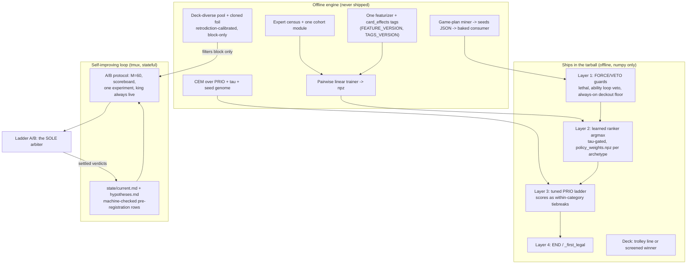

# feat: Unified number-one plan (deck-aware pilot + self-improving loop)

All paths repo-relative to ptcg-abc. No competition data appears in this document. No em dashes anywhere.

## Summary

This plan supersedes docs/plans/2026-07-01-001 as the loop's roadmap (that plan's loop-mode rules still govern HOW each iteration runs). The binding resource is not the ~225 remaining submission slots but settled ladder verdicts: plan against 18 to 22 settled A/B decisions before the Aug 8 last-start date (25+ is upside). Week one spends nothing speculative: reclaim the scored pair (~58 free points), restart the downed autoloop, and land six zero-dependency verdicts (PIMC diagnostic, expert-data census, noise calibration, unit-zero ranker spike, contract reconciliation, rules probe). Then two tracks sized to the decision budget: raise the pilot floor (trolley_thick settle, PTCG_ABILITY, CEM over the restored PRIO gradient, hand-coded seeds plus guards) and mount the joint deck-and-pilot attack the review demands (two-step attribution, deck-space exploration, a reconciled linear ranking pilot behind a four-layer guard stack). Ceiling bets (search revival, value net) are diagnostic-gated and dated. The final week converts the best build into the best latest-2 draw via an optimal-stopping noise campaign under the ~130-point same-build band. Every ladder claim runs through one pre-registered protocol with margin M=60, an episode-level scoreboard as the secondary statistic, and universal proxy retrodiction. The unattended loop executes one unit per iteration; the protocol, ledger, and refutation registry ARE the Strategy writeup on every branch.

## Goals (G1-G4 traced)

- G1 (#1 on the Simulation ladder by 16 Aug): Phase 0 protects the floor and buys information; Phase 1 pushes the pilot floor (realistic 600-750); Phase 2 is the main climb vehicle (joint deck+pilot, plausible 750-1000); Phase 3 holds the only credible #1 paths (search revival if U27 favors it, else doubled deck-aware breadth); Phase 4 converts skill into the best final draw. Honest read: #1 requires a Phase 2 or 3 bet to land; the floor path caps near 900 against a rising ~1300.
- G2 (Strategy top-8, $30k, 13 Sept, 70/20/10): Phases 0-4 manufacture the evidence continuously (pre-registered protocol, hypotheses registry, loss-bucket loop, honest refutations); Phase 5 assembles it. Every kill criterion is a chapter, so the story survives all branches.
- G3 (owner's theory: best all-around deck AND a pilot that executes complex skills): Phase 2 serves it directly per review P0-1/P1-3/P1-10/P1-11. Deck half = deck-space exploration (U39) plus the trolley_thick density line; pilot half = seeds+card_effects+guards (U33/U37), the ability lever (U34), and the learned ranker (U40/U41). The two-step attribution A/B (U38) finally measures a deck-AWARE pilot, which no prior experiment did (510/382 meta copies used the GENERIC pilot).
- G4 (self-improving loop): U21 restarts the downed tmux loop against this plan; every unit is one loop increment; state/current.md carries pre-registrations and the ledger; state/hypotheses.md keeps refutations stateful; U22 makes the protocol machine-enforced.

## Ground Truth Ledger (per prior unit, 2026-07-02)

| Prior unit | Status | Evidence |
| --- | --- | --- |
| U1 tarball/build machinery | LANDED; scored-pair reclaim PENDING (quota-locked 07-01) | autoloop_status.md NEXT entry; live pair = meta copies 510.1/382.5, ~58 pts below reclaimable |
| U2 bench-guard move ordering | REFUTED | benchguard 554.5 < 569.6; 94% of collapse moments had no benchable Basic (deck-density-bound) |
| U3 trolley_thick deck | LANDED offline (collapse 80.8 -> 65.4%, n=240, p<0.001); ladder A/B PENDING | deck analysis; rides in the reclaim pair |
| U4 opponent pool | Deck-pool half LANDED; replay-as-opponent half INFEASIBLE (review P2-12) | tools/opponents.py, tools/deck_harvest.py |
| U5 move-ranking validator | LANDED; not yet retrodiction-calibrated | analysis/move_ranking_validator.py; review P2-18 |
| U6 CEM tuner + weight space | LANDED; original genome FLAT, gradient RESTORED via 7 PTCG_W_PRIO_* dims (genome 18); real run PENDING | analysis/cem_signal_flat.md, analysis/cem_gradient_restored.md; first hypothesis PRIO_ATTACH earlier (0.2235 -> 0.2495, baseline 0.2292) |
| U7 PIMC diagnostic | NOT STARTED; zero unmet deps (review P1-6) | run now |
| U8/U9 search revival | GATED on U7; not started | search-active 514.7 vs 569.6 is INSIDE the noise band, unconfirmed |
| U10/U11 value net | CUT by default (review deferred question resolved here) | revival conditions in Kill Criteria |
| U12 loop state | LANDED | tools/loop_state.py; state/current.md + hypotheses.md; suite 365 pass |
| U13 cloned opponent | NOT STARTED; volume risk open | 21.6% expert agreement reads on 3 episodes/116 decisions (strict cohort) vs 40 episodes/1427 decisions (loose CEM holdout): cohort fork unresolved |
| U14 pilot rules | (b) energy-seq REFUTED (analysis/energy_seq_refuted_by_expert_moves.md); (a) ability lever exists default-off; (c) partial | absorbed into U34/U37 |
| Refutation registry | meta_deck_copy, search_active, bench_floor_leaf_term, thin_bench_threshold (deck-change re-test opted in), bench_dig, energy_seq, missed_lethal, cem_flat_gradient (resolved) | state/hypotheses.md |
| Autoloop | DOWN | restart is U21 |

Landed work is infrastructure and is never re-planned. Refuted levers re-enter only through their registered re-test conditions.

## Key Decisions

- KD1 Spine and grafts: Draft A's phase structure (won PATH-TO-FIRST and EXECUTABILITY) carries Draft C's measurement machinery (episode scoreboard, universal proxy retrodiction, unsettled-facts register, fitted noise model) and Draft B's throughput math, census tiers, and machine-checked pre-registration.
- KD2 Margin: initial M=60 (half the documented ~130 same-build span), never below 40; calibrated from the inert-search 591.9 vs trolley 569.6 same-behavior pair plus one deliberate king resubmission; re-fit ~Jul 20.
- KD3 Throughput: plan against 18-22 settled decisions; hard per-phase caps; a 2-candidate queue cap on all generators; the ~75-slot reserve absorbs the difference.
- KD4 Contract reconciliation (the digest's ~8 forks, one ruling each, recorded in U28): one featurizer module (agents/imitation_features.py) with a combined (FEATURE_VERSION, TAGS_VERSION) tuple asserted at dataset load, weight load, and build time; plain pairwise logistic linear model (s = X @ W + b, no embedding); deckout guard ALWAYS-ON above the scorer; md5(episode_id) mod 100 episode split in one shared module; lever name PTCG_POLICY; target archetype chosen by the selector (Grimmsnarl predicted, not hardcoded); one expert-cohort module (U25) decided before the census; one coverage tool (tools/tag_coverage.py).
- KD5 W_generic: DROPPED; fallback below a matched archetype block is the pure ladder. A pooled family block exists only if the census fires tier 2 (600-2500 groups).
- KD6 CEM timing: the real run lands EARLY (Phase 1, latest start Jul 8) per the ledger's registered next action; B's August deferral rejected (judges 2 and 3). Injected-variance regularization stays non-negotiable whenever the genome grows; throughput math is honest (sequential singleton engine, subprocess parallelism only).
- KD7 Search revival: branch selection fixed by the U27 verdict (due Jul 10) and never revisited; latest start Jul 27 (C's Aug window makes the branch decorative). The 514.7 vs 569.6 fact is re-confirmed under the protocol only if the lane opens.
- KD8 Endgame: A's noise campaign kept but re-specified as an OPTIMAL-STOPPING rule (every re-roll evicts the older scored submission, so pre-register a stop target and a no-roll buffer); design fixed by the U29 rules probe, conservative default = two copies of the king.
- KD9 Registry hygiene: before any attribution candidate runs, amend the meta_deck_copy row in state/hypotheses.md with the review-P0-1 re-test condition (a deck-AWARE pilot was never measured). Re-walks are registered, never asserted.
- KD10 Explore cadence: kept in bounded form. Every 4th loop iteration checks tools/loop_state.py retest for refuted hypotheses whose conditions are met and runs the re-test OFFLINE; ladder slots still flow only through the protocol. Rationale: bench_dig flipped direction at a larger sample.
- KD11 Gates tolerate noise: Phase 1 exits on one settled WIN or two settled NEUTRALs with the floor intact (proceed either way); zero-win weeks trigger a calibration audit that halts LADDER spend only, never offline building.
- KD12 Restored protections: enum-drift defense (KTD8), engine-version drift diff, battle_start legality on every deck candidate, MSR-3 effect-tag coverage gate, duplicate-option label handling, featurizer latency budget with soft-cap bailout, weights-load grader regression, one shared out-path isolation helper.

## High-Level Design

Guards permanently outrank the scorer. Every lever is byte-identical unset. All agents/heuristics.py edits serialize under one owner per iteration.

## Implementation Units

New stable IDs start at U20. Every ship-facing unit must pass tests/test_grader_submission.py on the exact tarball and preserve never-raise.

### Phase 0: Floor, loop restart, cheapest information first (Jul 2-8)

#### U20 Scored-pair reclaim (completes prior U1)
- Goal: both scored slots hold our strongest heuristic builds; recovers ~58 points.
- Deps: none. Files: tools/build_submission.py, state/current.md, autoloop_status.md.
- Approach: board-check, grader exec-without-__file__ on each exact tarball, then slot 1 = heuristic+trolley king (evict archaludon 382.5), slot 2 = heuristic+trolley_thick (evict grimmsnarl 510.1). Slot 2 doubles as the pending U3 ladder A/B, pre-registered first.
- Tests: none (hygiene). Verification: kaggle submissions shows the intended pair; ledger row complete.

#### U21 Autoloop restart + LOOP_BRIEF rewrite (execution vehicle)
- Goal: the downed tmux loop runs against THIS plan.
- Deps: none. Files: LOOP_BRIEF.md, autoloop_status.md.
- Approach: replace the roadmap section (directive text shipped with this plan), keep loop-mode/submission-discipline/hard-constraints sections; restart; verify one clean measure-first iteration. Includes the manual daily fallback (board check, one pre-registered decision, hand-updated ledger) if the loop cannot revive by Jul 4.
- Verification: one committed iteration whose first action was loop_state refresh.

#### U22 Protocol codification + noise model (supersedes digest MSR-4)
- Goal: the A/B protocol is machine-enforced, not conventional.
- Deps: U12 (landed). Files: tools/loop_state.py, state/current.md, tests/test_loop_state.py.
- Approach: pre-registration schema (hypothesis id, direction, margin M, episode floor N, settle-by date, offline filter values, committed WIN/LOSS/BAND actions); an incomplete row mechanically blocks submission. Noise model v1: M=60 from the 591.9/569.6 same-behavior pair plus one deliberate king resubmission; margins and re-fit dates published in state/current.md.
- Tests: incomplete row blocks; round-trip; margin arithmetic. Verification: a dry-run submit without a row is refused.

#### U23 Episode-level scoreboard + early stop (graft, new)
- Goal: raise settled-decisions-per-day, the binding resource.
- Deps: scout digests. Files: analysis/episode_scoreboard.py, tests/test_episode_scoreboard.py.
- Approach: per-episode W/L vs opponent-rating brackets for every scored build; secondary settlement statistic (band tiebreak at ~90% binomial confidence on shared brackets); early-stop eviction under 35% raw win rate after 15 episodes; free same-build noise data.
- Verification: retrodicts the recorded W/L of the five known builds.

#### U24 Universal proxy retrodiction gate (supersedes review P2-18 fix)
- Goal: no uncalibrated proxy ever gates a slot.
- Deps: U5 (landed). Files: analysis/proxy_calibration.py, tests/test_proxy_calibration.py.
- Approach: every offline gate (move-ranking validator, collapse harness, cloned/deck-diverse gauntlet, any future proxy) must retrodict the known five-build ordering (569.6 > 554.5 > 514.7 > 510.1 > 382.5) before it may block a slot. A passing proxy still only BLOCKS, never promotes.
- Verification: calibration report committed per proxy; loop_state refuses gates from uncalibrated proxies.

#### U25 Expert cohort module + full census (resolves review deferred Q1)
- Goal: replace the 3-episode/116-decision sample read with a full 5734-episode count.
- Deps: none. Files: analysis/expert_cohort.py, tools/expert_census.py, analysis/expert_census.md, tests/test_expert_cohort.py.
- Approach: ONE cohort definition first (resolving the 3/116 vs 40/1427 fork), then count expert-anchored episodes, winning seats, MAIN decisions, and ranking groups per archetype family. Pre-committed tiers: >=2500 groups for the target family = full per-archetype training; 600-2500 = winners-only cloning plus family pooling; <600 = kill learned-pilot training. Continue daily zip harvest for a mid-July tier upgrade. Route all output through the shared isolation helper (U30).
- Verification: verdict doc with per-family counts; tier action recorded in state/current.md by Jul 8.

#### U26 Unit-zero ranker spike (supersedes digest critique 7)
- Goal: test the central linear-ranker bet before ~26 units are built.
- Deps: U25 cohort module. Files: scratch under data/derived/ (gitignored), analysis/unit_zero_spike.md.
- Approach: 1-2 day hack extract (~20 features), sklearn pairwise ranker, per-category held-out agreement vs the recomputed per-archetype baseline. PASS = >= +0.03 top-1 AND reorders at least one known-gap category (ability, currently 0 vs 554-class usage).
- Verification: written verdict by Jul 9; gates the entire U40/U41 pipeline.

#### U27 PIMC diagnostic (completes prior U7; review P1-6)
- Goal: decide the search-revival branch from data, now, offline.
- Deps: none. Files: analysis/pimc_diagnostic.py, analysis/pimc_diagnostic.md, tests/test_pimc_diagnostic.py.
- Approach: Long et al. leaf-correlation, bias, disambiguation on real states; handles fully-observed states without divide-by-zero.
- Verification: favorable/unfavorable verdict committed by Jul 10; sole gate for U45; the branch decision is never revisited.

#### U28 Contract reconciliation record (supersedes digest reconciliation pass)
- Goal: the ~8 forked contracts get one written ruling each (KD4/KD5).
- Deps: none. Files: docs/design/deck-aware-execution-design.md (decisions appended), state/current.md.
- Approach: record featurizer path+version tuple, model equation, guard defaults, split authority, lever name, target selection authority, cohort module, coverage tool, W_generic ruling.
- Verification: decisions section committed before any U40 code exists.

#### U29 Rules probe (resolves review deferred Q2 and the portfolio residual)
- Goal: confirm final-week freeze/re-score behavior and latest-2 scored-pair semantics.
- Deps: none. Files: analysis/final_scoring_semantics.md.
- Approach: rules page plus, if ambiguous, one cheap probe; decides the U48 design. Default if unresolved by Jul 10: conservative two-copies-of-king lock.
- Verification: written answer gating U48.

#### U30 Ship-safety hardening (restores original KTD8/R3 + digest isolation)
- Goal: close the crash and leak classes every new module multiplies.
- Deps: none. Files: agents/heuristics.py, agents/card_effects.py (when it lands), tools/isolation.py, tests/test_grader_submission.py, tests/test_safety.py.
- Approach: unknown OptionType/SelectType values degrade to the safe legal fallback in the pilot, featurizer, and card_effects (negative grader-exec test); scheduled diff of vendored cg/ and cabt.json against the current pip engine now and again before the Aug 10 freeze; ONE shared out-path isolation helper that every new extraction tool (census, scoreboard, screening, miner) must route through.
- Verification: negative tests green; drift diff clean or triaged; isolation helper imported by every new tool.

### Phase 1: Pilot floor push + hand-coded deck awareness (Jul 6-19)

Gate: one settled WIN over 569.6 at margin M, or two settled NEUTRALs with the king floor intact (proceed either way, KD11). ML spend additionally requires the U26 spike positive.

#### U31 trolley_thick settle (completes prior U3)
- Goal: settle the density hypothesis on the ladder. Deps: U20, U22.
- Approach: read the reclaim A/B under the protocol; WIN promotes to king; LOSS reverts the slot to a king copy and records the refutation with sample size and a re-test condition (re-run with the aware pilot later, since collapse may be pilot-limited).
- Verification: settled ledger row.

#### U32 Replay-trace spine + per-archetype baselines (supersedes digest DU2 + MSR-1)
- Goal: the shared resolved-decision population every downstream unit consumes; lands FIRST per digest sequencing.
- Deps: U25. Files: analysis/replay_trace.py, analysis/move_ranking_validator.py (lift and re-export), tests/test_replay_trace.py.
- Approach: lift iter_expert_decisions with option-to-card/attack resolution; recompute per-archetype expert-agreement baselines on the frozen md5 split (the global 0.212 is not transferable).
- Verification: existing validator tests green; baselines committed.

#### U33 card_effects knowledge layer + coverage gate (supersedes memo2 U1-U4 + MSR-3)
- Goal: stdlib card-knowledge layer with frozen behavior.
- Deps: U30. Files: agents/card_effects.py, tools/tag_coverage.py, tests/test_card_effects.py, tests/test_heuristic.py.
- Approach: tag_text over fixed TAG_VOCAB, three-state degradation (UNKNOWN_CARD/UNTAGGED_EFFECT/empty), TAGS_VERSION drift gate, heuristics delegation behavior-frozen by golden pool-wide equivalence before old code is deleted; heuristics keeps _card_text (test seams). MSR-3: coverage meter with a 100% target-deck coverage requirement before any aware-pilot build (seeds or ranker) may spend a ladder slot, plus the ratcheting untagged-fraction audit.
- Verification: all ~60 existing heuristic tests pass unmodified; golden equivalence green; coverage report at 100% for the target deck.

#### U34 PTCG_ABILITY single-variable A/B (supersedes prior U14a as a lever A/B)
- Goal: the cheapest named fast win (+0.013 top-1 offline, ability agreement 0 -> 0.139).
- Deps: U22. Latest start Jul 10. Approach: pre-registered single-variable ladder A/B.
- Verification: settled verdict; on WIN the lever bakes into the king.

#### U35 Real CEM run over the PRIO genome (completes prior U6)
- Goal: the engine's first real gear, on the restored gradient. Latest start Jul 8.
- Deps: U22, U24 (pool calibrated). Files: tools/cem_tune.py (landed, unmodified), analysis/cem_runs/.
- Approach: 18-dim genome; first hypothesis PRIO_ATTACH earlier (0.2235 -> 0.2495); fitness = expert-move agreement plus the deck-diverse pool; injected-variance regularization NON-NEGOTIABLE (the collapse test guards it); honest sequential-singleton throughput (subprocess parallelism only, iterations measured in hours). Offline filters block; max two ladder candidates this phase.
- Verification: a tuned candidate passes filters and gets one pre-registered A/B.

#### U36 Target selector + game-plan miner + seeds emitter (supersedes digest DU1/DU3/DU4)
- Goal: mastery-scored target family and thresholded machine seeds.
- Deps: U32. Files: tools/archetype_select.py, analysis/gameplan_mine.py, analysis/gameplans/, tests/test_gameplan_mine.py, tests/test_gameplan_seeds.py.
- Approach: mastery score = expert wins times expert win rate (raw wins are a popularity artifact); selector free to disagree with the Grimmsnarl prior. Miner: six stat blocks, wins contrasted with losses; seeds JSON at 0.70 share / 0.80 timing / 0.95 unanimity; blocks under 0.90 resolution_rate barred.
- Verification: targets.json plus a seeds file with provenance; human game-plan doc for the writeup.

#### U37 Seeds CONSUMER + ordered guard stack (supersedes digest critique 4 + U-E4 + MSR-8; absorbs prior U14c)
- Goal: the previously unowned Phase A deliverable: hand-coded deck awareness that actually changes ladder behavior.
- Deps: U33, U36. Files: agents/heuristics.py, tools/build_submission.py, tests/test_heuristic.py, tests/test_safety.py.
- Approach: bake seeds as build-time dict constants applied in attach targeting, bench targets, fetch priorities, and the deckout floor, behind a default-off lever, byte-identical unset. Ordered FORCE/VETO layer: lethal force, loop-safety ability veto, always-on deckout veto, thin-bench force, Rare Candy force; permanently above any scorer.
- Verification: byte-identical unset; guard-order tests; one pre-registered seeds-build A/B.

### Phase 2: Joint deck-and-pilot attack (Jul 13 - Aug 3, overlaps Phase 1)

Gate: a deck+pilot build beats the king at M, or step-1 attribution shows pilot-factor recovery (justifying continued ML spend); otherwise the bet dies Aug 3 and its budget rolls forward.

#### U38 Registry amendment + two-step attribution A/B (supersedes memo5 Phase A protocol; the review P0-1 re-test)
- Goal: isolate the pilot factor, then face the incumbent.
- Deps: U37 (step 1 can run on the hand-coded aware pilot); latest start Jul 18.
- Approach: FIRST amend the meta_deck_copy row in state/hypotheses.md with the new re-test condition (deck-AWARE pilot never measured, per KD9). Step 1: target deck + aware pilot vs same deck + generic pilot. Step 2 (the success gate): best aware build vs the trolley incumbent. Both margins pre-registered before either candidate runs. Step 1 is the go/no-go for U40/U41 ladder spend.
- Verification: two settled ledger rows; registry row amended before submission.

#### U39 Deck-space exploration (supersedes review P1-3/P1-10; the best-deck half of G3)
- Goal: search deck space instead of copying it. Latest start Jul 20.
- Deps: U4 pool (landed), U24. Files: tools/deck_harvest.py, tools/deck_validate.py, analysis/deck_screening.md.
- Approach: harvest ~150 decks from episodes plus density/draw/tech variants around the trolley line; EVERY candidate passes battle_start legality (errorPlayer == -1), copy limits, and ACE SPEC via tools/deck_validate.py before any gauntlet row; screen under the current best pilot vs the deck-diverse pool with per-opponent rows; weak bots banned from gates; top 2-3 earn pre-registered A/Bs.
- Verification: screening matrix committed (aggregates only); at least one deck candidate settled on the ladder.

#### U40 Unified featurizer + imitation dataset (supersedes memo1 U1-U6 per KD4; gated on U25 tier + U26 spike)
- Goal: one ship-safe featurizer and a ranking-group dataset.
- Deps: U26 PASS, U25 tier >= 2, U32, U33. Files: agents/imitation_features.py, tools/imitation_extract.py, analysis/imitation_dataset.py, tests/test_imitation_features.py, tests/test_imitation_dataset.py.
- Approach: ranking groups (one row per legal option, argmax within group); ~55 base features PLUS the card_effects TAG_VOCAB multi-hot per option; one (FEATURE_VERSION, TAGS_VERSION) tuple asserted at dataset load, weight load, build time; md5 episode split via the shared module; duplicate-option handling (collapse feature-identical options or multi-positive labels in v1); sentinels (obs-only, permutation invariance, split integrity, mandatory shuffled-label control); volume/balance QA gate before training.
- Verification: bit-for-bit extraction/inference round-trip; sentinels green.

#### U41 Trainer + scorer seam + four-layer MAIN flow (supersedes memo3 U-E1/E3/E5/E6 + MSR-6/7)
- Goal: the learned pilot behind the guard stack. Latest start Jul 16 (build), ladder entry gated on U38 step 1.
- Deps: U37, U40. Files: tools/train_policy.py, agents/policy.py, agents/heuristics.py, tests/test_policy.py, tests/test_grader_submission.py.
- Approach: pairwise logistic linear W,b per-archetype blocks in one policy_weights.npz (no W_generic per KD5); ONE module-global option-scorer hook in agents/heuristics.py (default None, byte-identical unset, PTCG_POLICY=1 baked at build), reaching all three call sites including search/rollout.py; four layers: guards > tau-gated confident argmax > PRIO ladder with score tiebreaks > END/_first_legal; degrade to the exact current ladder on missing weights, unknown archetype, version mismatch, or any exception; <5ms featurizer budget with soft-cap bailout to the generic ladder; weights-load path reuses the no-__file__ guard and extends the grader regression.
- Verification: composed-pilot pre-gates (per-archetype agreement vs U32 baselines, calibrated gauntlet) as filters only; then one pre-registered A/B.

#### U42 BC-as-pilot direct trial (supersedes review P1-11)
- Goal: the cheapest direct test of the owner's execution theory.
- Deps: U41 weights. Approach: the cloned policy pilots the target complex deck in the calibrated gauntlet; tau swept offline; if pre-gates clear, one pre-registered ladder slot.
- Verification: gauntlet rows plus at most one settled A/B.

#### U43 Cloned opponent, one model three roles (supersedes prior U13 + memo3 U-E7)
- Goal: gauntlet foil and measurement oracle from the same npz. Latest start Jul 22.
- Deps: U41. Files: tools/opponents.py, agents/policy.py, tests/test_opponents.py.
- Approach: same weights serve pilot tiebreaker and anti-overfit foil; the rollout-opponent role stays PARKED behind a testable seat-identity contract (record the real player index at install time or thread a seat tag; digest critique 5) written and tested before any rollout wiring; the clone must beat the generic heuristic on expert agreement AND pass U24 retrodiction before its gauntlet counts; until then harvested decks piloted by the heuristic stand in (review P2-12).
- Verification: retrodiction pass; seat-identity contract tests green before U45 consumes it.

#### U44 Loss-bucket instrumentation refresh (supersedes digest MSR-2)
- Goal: decompose early_collapse (21/21 of classified losses) so bucket movement stays attributable as the deck changes.
- Deps: U12 (landed). Files: analysis/loss_classifier.py, tests/test_loss_classifier.py.
- Verification: refreshed distribution in state/current.md; the 2pp no-bucket-worsening veto keys off it.

### Phase 3: Gated ceiling bets (Jul 20 - Aug 8)

#### U45 Belief-weighted search revival (supersedes prior U8+U9; ONLY if U27 favorable)
- Goal: the search-branch #1 path. Latest start Jul 27.
- Deps: U27 favorable, U43 seat-identity contract. Files: search/determinize.py, search/rollout.py, tests/test_determinize.py.
- Approach: reach-weighted worlds via the U43 policy plus archetype-biased deal priors; more-worlds-shallower and EPIMC stacked only after the first read is in-band-or-better; the tuned heuristic king stays live throughout; the 514.7 vs 569.6 fact is re-confirmed under the protocol as part of this lane, never before.
- Verification: search-active must read in-band-or-better by Aug 3 and beat the king at M by Aug 8, else the branch closes forever.

#### U46 Doubled deck-aware breadth (the U27-unfavorable branch; review P0-2)
- Goal: the named #1 path when search stays dead.
- Deps: U27 unfavorable. Approach: Phase 2's decision budget doubles: wider deck-space screening plus the aware pilot on a second target family; ceiling stated honestly (~900-1000) in the writeup; the PIMC diagnostic becomes a theory-grounded negative-result chapter.
- Verification: reallocated budget recorded in state/current.md; branch never flips back.

### Phase 4: Consolidation and final lock (Aug 8-16)

#### U47 Feature freeze + final regression (restores original R3 discipline)
- Goal: protect the achieved rating. Aug 8 last new A/B start; Aug 10 feature freeze.
- Approach: grader exec regression on the exact final tarballs; engine-drift diff re-run (U30); only promotion, revert, and noise-campaign actions remain.
- Verification: regression green on both shipped tarballs.

#### U48 Final-pair optimal-stopping campaign (design fixed by U29; resolves the review portfolio residual)
- Goal: convert true skill into the best latest-2 draw under the ~130-point band.
- Deps: U29, U47. Approach: pre-register NOW: default pair = two copies of the strongest settled build; a diverse hedge only if the runner-up is within M and mechanically different. Campaign = re-roll the king with a STOPPING RULE (stop when the live pair's best draw >= king-true-estimate + 40; every re-roll evicts the older submission, so never roll past a good draw), hard no-roll buffer from Aug 14 12:00 UTC; final pair locked by Aug 15 with one full day of slack.
- Verification: stop target and pair rule in state/current.md before the first re-roll; deadline met.

### Phase 5: Strategy writeup (drafted from Jul 6; final Sep 13)

#### U49 Running writeup + evidence appendix
- Goal: nothing is reconstructed from memory in September.
- Approach: update writeup.md every few loop iterations, every claim citing a committed analysis file; evidence appendix (per-build ledger, pre-registrations, calibration results, refutation registry) GENERATED from state/, no competition data redistributed.
- Verification: writeup.md current at every phase gate.

#### U50 Final Strategy writeup
- Goal: top-8. Approach: <= 2000 words against the 70/20/10 rubric; full draft Aug 20; humanizer pass; frozen Sep 10, submitted by Sep 10 (3-day buffer to Sep 13).
- Verification: a non-author can follow the decision procedure from the text alone.

## Calendar and Slot Budget

~225 raw slots (45 days x 5/day). Binding resource: settled A/B decisions, planned at 18-22 (stretch 25); each costs 1-3 slots and 1-2 days; in-band repeats cost 2 more.

| Phase | Window | Slots | Settled decisions | Gate |
| --- | --- | --- | --- | --- |
| 0 | Jul 2-8 | 4-6 (reclaim 2, calibration resubmit 1, spare) | 1 (trolley_thick rides the reclaim) | kings live, loop up, six verdicts written |
| 1 | Jul 6-19 | ~14 | 5-6 (thick settle, ability, <=2 CEM, seeds build) | one WIN or two NEUTRALs, floor intact |
| 2 | Jul 13 - Aug 3 | ~18 | 6-7 (attribution x2, decks x2-3, BC trial, ranker) | beat king at M or step-1 recovery |
| 3 | Jul 20 - Aug 8 | ~10 | 3-4 (branch-dependent) | beat the then-king at M by Aug 8 |
| 4 | Aug 8-16 | ~30-40 (draws, not decisions) | 0 | best pair locked by Aug 15 |
| Reserve | all | ~75 unallocated | absorbs repeats, quota locks, infra | never both slots experiments |

Latest starts: U35 Jul 8, U34 Jul 10, U37 Jul 12, U41 build Jul 16, U38 Jul 18, U39 Jul 20, U43 Jul 22, U45 Jul 27. Slot arbitration when tracks compete: in-flight settlement first, then floor reclaim, then the track with the nearest kill date.

## A/B Decision Protocol

1. Slots: slot 1 always holds a king; slot 2 is the single live experiment; never two experiments (the 07-01 live pair is exactly that failure). Board-check before every submit; one submit per loop iteration.
2. Pre-registration: machine-checked in tools/loop_state.py (U22); a row missing hypothesis, direction, margin, N, settle-by, filter values, or committed WIN/LOSS/BAND actions blocks submission.
3. Margins: M=60 initial (half the ~130 same-build span), floor 40, re-fit ~Jul 20 from accumulated same-build data; margins live in the ledger, not in heads.
4. Settlement: read after >= 30 rated episodes per build AND >= 24h (or drift < ~5 pts per 12h). WIN >= king + M (promote, commit, update registry). LOSS <= king - M (evict immediately with a king copy). Early stop: under 35% raw win rate after 15 episodes = evict.
5. Band rule: exactly one repeat resubmission; settle WIN only if both readings are positive AND the U23 scoreboard favors the candidate at ~90% binomial confidence on shared opponent brackets; otherwise NEUTRAL, revert to king, record with a re-test condition, never silently retried.
6. Offline epistemics: proxies BLOCK only, never promote; a proxy gates slots only after passing U24 retrodiction; the weak-bot gauntlet is banned from all gates; never submit a build that worsens any loss bucket by >= 2pp even with headline win rate up.
7. Unsettled register: search costs ~55, the stale-inert 591.9, and trolley_thick's expected gain are UNSETTLED until read under this protocol; re-confirmation slots are spent only when a lane decision depends on the fact.
8. Generators (CEM, deck variants) write to a ranked queue capped at 2 candidates awaiting slots; the rest are shelved offline.
9. Attribution order: U38 step 1 must settle before step 2 may spend slots.
10. Wide-noise contingency: if M re-fits above ~90, shift settlement weight to the scoreboard binomials, raise N, cut the queue, and prefer compounding onto the king over new single-lever A/Bs.

## Contingency Branches

- U27 UNFAVORABLE (expected base case): search closes with zero ladder spend; stack stays offline teacher only; U45 budget moves to U46 (doubled deck-aware breadth); the diagnostic becomes a writeup chapter. The primary track never depended on it (review P0-2 satisfied).
- EXPERT DATA THIN (U25 tiers): 600-2500 groups = winners-only cloning (outcome columns already stored, so the cohort softens without re-extract) plus family pooling with a one-hot; <600 = kill U40/U41 training outright, ship the hand-coded layer (U33/U36/U37 seeds + guards + ability), reallocate to U39 depth and U35; harvest zips daily for a mid-July tier upgrade. The Strategy story survives: mined game plans plus a guard stack is still deck-aware execution, with the census as evidence.
- CEM PLATEAU (two consecutive candidates fail filters or settle neutral, first read ~Jul 15): stop dedicated CEM ladder spend; budget moves to deck-space and hand-coded levers; CEM retained solely to tune new levers (tau, seed weights); re-opens only on genome growth with a measured non-flat gradient (the cem_signal_flat to cem_gradient_restored precedent).
- DECK-AWARE PILOT UNDERPERFORMS (U38 step 1 shows no recovery within 2 settled A/Bs or by Aug 3): kill the bet's ladder spend; no further meta-deck or ranker submissions; U39 screening and U35 CEM take the slots; artifacts retained for the writeup. If everything is neutral by Aug 3, enter consolidation early; the guaranteed floor is tuned pilot + best-found deck + protected kings (~600-750) with the full G2 narrative.
- INFRA/LOOP DOWN: manual daily protocol (U21) with identical rules; loop restoration is always the next iteration's first unit; any unexplained live-pair drop triggers a king reclaim on the very next slot before any experiment resumes.

## Kill Criteria

- Jul 6: reclaim not landed = all LADDER-facing spend stops until the board is fixed; offline building continues.
- Jul 8: census verdict due; <600 target-family ranking groups kills learned-pilot training (tier branch applies); <500 pooled kills all training.
- Jul 9: U26 spike verdict; failure kills the U40/U41 pipeline as specced (tiny-MLP head only if census volume supports it, one week timebox); hand-coded layer proceeds regardless.
- Jul 10: U27 verdict fixes the Phase 3 branch permanently; U29 rules answer due or U48 defaults to two-copies-of-king.
- ~Jul 15: CEM plateau rule live (two consecutive non-WIN candidates).
- Aug 3: deck-aware ladder spend dies without step-1 recovery; U45 must have read in-band-or-better.
- Aug 8: U45 must beat the king at M or the search branch closes forever; last new A/B start.
- Jul 30: value net (old U10/U11) stays dead unless CEM plateaued early AND the spike was strongly positive AND work starts by Jul 30; after that, cut with no revisit before Aug 16.
- Aug 10: feature freeze; only promotion/revert/noise-campaign actions remain.
- Absolute floor guard (no date): if the live pair's best settles below ~540, the next slot is a king copy, overriding every queue.
- Sep 10: writeup frozen and submitted; every claim traceable to a committed analysis file.

## Strategy Prize Plan (the story on every branch)

The writeup IS the method: a stateful, unattended, loss-bucket-driven loop (ledger, falsified-hypothesis registry with sample sizes and re-test conditions) wrapped in unusually honest measurement (pre-registered A/Bs against a documented ~130-point noise band, a fitted noise model, offline proxies that must retrodict known ladder outcomes and may only block, a banned non-predictive gauntlet, refutations treated as stateful). The theory-of-victory chapter is the joint deck-and-pilot claim with two-step attribution, which separates the deck factor from the pilot factor, something the field's meta-copying norm does not do. Branch heroes: search revival = a diagnostic-gated resurrection of a refuted method; deck-aware = expert-decision ranking groups over one ship-safe featurizer behind guards that never let learning override safety; all-negative = the discipline itself (search costs points, meta decks fail under a generic pilot, guards are deck-bound, CEM's gradient was engineered back into existence), proven by 45 days without once promoting noise. Deck concept (20%) comes from the U39 screening matrix, the density result, and the mined game plans; writeup (10%) from the U49 habit and the state-generated appendix. Every kill criterion is a chapter.

## Risks

- Settle throughput binds: only 18-22 verdicts realistically fit; guarded by hard caps, the queue cap, the scoreboard, and machine-checked pre-registration.
- The ~130-point band can fake wins and kills even at M=60 plus the repeat rule; residual risk is bounded, not removed.
- Expert volume is open until the census; the whole imitation stack sizes on U25, which is why it runs in week one.
- The linear-ranker bet is unproven until U26; a weak spike caps the pilot half at seeds+CEM.
- #1 realistically requires a Phase 2 or 3 bet to land against a rising ~1300 bar; the plan maximizes shots and honesty, not certainty.
- Protocol drift under autonomy already cost points; the mechanical ledger block and kings-first rule are the guards, and U21's clean restart is itself a risk item.
- Never-raise/grader regressions multiply with each lever; byte-identical-unset defaults, the guard rung order, enum-drift defense, and the exact-tarball regression are non-negotiable.
- Rules unknowns could invalidate U48; U29 resolves them by Jul 10 or the conservative default holds.

## Scope Boundaries

- IN: everything in U20-U50; the four-layer pilot; hand-coded seeds and guards; the reconciled imitation pipeline; deck-space exploration; CEM over the enlarged genome; the gated search revival; the optimal-stopping endgame; the writeup.
- DEFERRED: tiny-MLP head (same npz, only if linear plateaus AND volume supports it); SEL_CARD sub-select training (schema columns exist now); full ISMCTS; a richer belief model; value net (dead by default, revival conditions above).
- OUT: meta-deck copying with a generic pilot (refuted; re-enterable only through the amended registry condition); online/network anything at match time; re-walking refuted levers on faith; GPU-scale training; committing or redistributing competition data.

## Success Metrics

- Leading (filters only): early_collapse rate (from 21/21 of classified losses downward), per-archetype expert agreement vs the U32 baselines, calibrated-gauntlet rows, target-deck effect-tag coverage at 100%.
- Lagging (the only truth): settled ladder verdicts. Phase 1 beats or holds 569.6 with the floor intact; Phase 2 beats the king at M or proves pilot-factor recovery; Phase 3 beats the then-king by Aug 8; Phase 4 locks the best pair by Aug 15.
- G1: final best-of-pair rating, target #1, honest fallback ~900 band with the full narrative.
- G2: writeup submitted by Sep 10, every claim ledger-traceable.
- G4: the loop runs unattended through Aug 16 with zero unregistered submissions.
