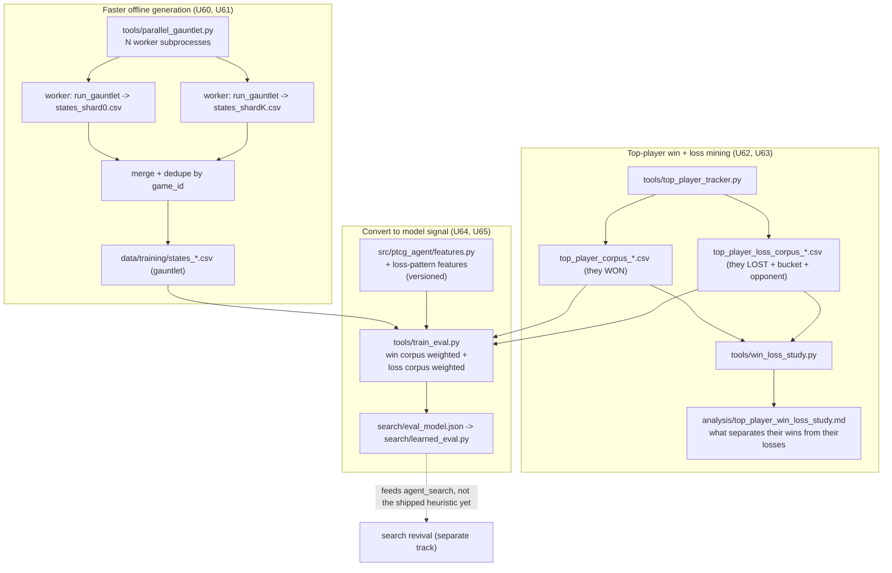

# feat: scale offline matches + mine top-player wins and losses

**Target repo:** `ptcg-abc` (all paths relative to it). **U-IDs U60-U65** are chosen to not collide with the
active learned-eval branch's units (U1-U12, U3a/U3b/U3c).

## Summary

Two linked capabilities. First, generate far more offline matches per hour by running the gauntlet across
worker processes on this 20-core machine (the native engine is a per-process singleton, so the win is
process-parallelism, not threads), with an optional raw-engine fast path for pure data generation. Second,
mine the top leaderboard players' games for both how they win and how they lose: extend the corpus to
capture top teams' losing games, produce a "what separates their wins from their losses" study, and turn the
loss data into model signal (weighted negative examples plus new loss-pattern features).

Honest framing: this accelerates offline iteration and sharpens the learned models and the Strategy writeup.
It does not move the shipped heuristic's ladder rank on its own, since the learned eval feeds `agent_search`,
not the shipped `agent_heuristic`, until a search-revival ships. The value is faster, better learning and a
genuine understanding of the field, not an instant rank bump.

---

## Problem Frame and Goal

- **Goal (throughput):** raise offline match generation from single-process sequential (roughly one of 20
  cores in use) to process-parallel, so dataset generation and every A/B settle in minutes, not the ~30-minute
  iterations we see now.
- **Goal (learn from the best):** understand how the top-ranked teams win, how they lose, and what makes the
  difference, then convert that into training signal the learned models consume.
- **Where we stand:** the top-player tracker (U3c) already produced a 173,663-row winning-seat corpus from the
  top 20 teams. It captures how they WIN. It does not yet capture how they LOSE, and nothing contrasts the two.
- **Hard constraints (inherited):** the shipped agent runs fully offline (python+numpy only); competition data
  stays isolated under gitignored `data/`, never redistributed; no em dashes anywhere; the grader loads
  `main.py` via `exec()` with no `__file__`, entrypoint last, never raise, engine is a process-global
  singleton; `tests/test_grader_submission.py` gates every build.

---

## Key Technical Decisions

### KTD1. Match parallelism is process-level, mirroring the existing subprocess pattern.
`engine.run_match` builds a fresh env per match, so worker processes do not fight the per-process singleton.
A new `tools/parallel_gauntlet.py` chunks the match count across N workers, each a subprocess running the
existing `run_gauntlet`, mirroring `tools/cem_tune.py`'s `subprocess_fitness` and `tools/run_ab.py`. Default
N = min(cores - 2, 16) to leave headroom for the autoloop.

### KTD2. Each worker logs to its own CSV; the parent merges and dedupes by game_id.
The `_StateLogger` owns one file handle per process, so shards cannot share it. Each worker writes
`states_shard<k>_<ts>.csv`; the parent concatenates and dedupes. This makes shard-unique game_ids and a
distinct per-shard RNG seed mandatory: without them shards either collide on merge or regenerate the same
matches. Each shard namespaces its game_ids (`shard<k>:<i>`) and takes a distinct base seed so it produces
DISTINCT games.

### KTD3. The losing-seat data already exists; loss mining is tagging, not new extraction.
`replays_to_rows.rows_from_replay` already emits one row per seat per decision, each labeled with that seat's
own outcome, so the loser's rows are present. Top-player loss mining adds a `top_player_loss` source tag for
games where a top-N team was the LOSING seat, plus the loss bucket (from `loss_classifier`) and the opponent
who beat them. No new per-decision extraction is required.

### KTD4. Loss enters the model two ways, both gated on an A/B.
(a) As weighted rows through the existing `--source-weights` / `--extra-csv` hooks in `tools/train_eval.py`
(losses are already label 0, so no new label is needed; the weight controls how hard the model learns to avoid
losing-shaped states). (b) As new loss-pattern FEATURES that make loss-shaped danger visible to the scorer.
Neither ships unless it holds or improves held-out AUC and does not worsen the loss-mode check.

### KTD5. Feature additions are append-only and versioned, and ship coupled with a retrain.
New features append to `FEATURE_NAMES` with a `FEATURE_VERSION` bump. Because changing the vector length
invalidates the shipped `search/eval_model.json` (which carries a fixed-length coefficient array), the feature
unit and the retrain unit must ship together and re-verify the grader-load path, exactly like the deck+pilot
coupling in the prior plan.

### KTD6. Everything stays offline, isolated, and local.
New corpora are derived data under gitignored `data/training/`; only code and small reports are committed. The
Kaggle token stays at `~/.kaggle/access_token`. Parallelism runs on this machine (not the remote box, per the
scope decision), capped to leave cores for the loop.

---

## High-Level Technical Design

---

## Implementation Units

Every code unit gates on `python -m pytest tests -q` and stays offline. Mock the engine and use synthetic
replays for tests (mirror `tests/test_features.py` and `tests/test_gauntlet.py`); never require the native
`cg` engine or real competition data in a test.

### U60. Parallel gauntlet shard runner (local, N workers)
- **Goal:** run the gauntlet across worker processes so offline match generation scales roughly with cores.
- **Dependencies:** none.
- **Files:** `tools/parallel_gauntlet.py`, `tests/test_parallel_gauntlet.py`.
- **Approach:** chunk the requested match count into N shards; spawn N subprocesses each invoking the existing
  `run_gauntlet` (mirror `tools/cem_tune.py` `subprocess_fitness`); each shard writes its own temp state-log CSV
  and takes a distinct base seed and a game_id namespace (`shard<k>:<i>`); the parent merges the temp CSVs,
  dedupes by game_id, aggregates wins/draws/losses and pooled decision times, and cleans up temp files. Default
  N = min(cores - 2, 16). CLI mirrors `gauntlet.py` (agent, opponents, `-n`, `--log-states`, `-o`) plus
  `--jobs`.
- **Patterns to follow:** `tools/cem_tune.py` subprocess fan-out; `tools/gauntlet.py` `_StateLogger` schema.
- **Test scenarios:**
  - Happy path: N shards over M matches produce a merged CSV whose row count equals the sum of shard rows and
    whose game_ids are unique across shards.
  - Distinctness: two shards with different seeds generate different game_ids (not duplicate matches).
  - Aggregation: merged win/draw/loss counts equal the sum of per-shard counts.
  - Error path: one worker exiting nonzero is logged and skipped, and the parent still merges the survivors and
    reports the shortfall rather than raising.
  - Edge: `--jobs 1` behaves identically to the sequential gauntlet (single shard, no namespace collisions).
  - Integration: a small real run against the built-in pool produces a valid merged states CSV consumable by
    `train_eval.load_rows`.
- **Verification:** a fixed match count completes in roughly wall-clock / min(jobs, cores) versus sequential,
  and the merged CSV loads and game-splits cleanly in `train_eval`.

### U61. Raw-engine fast data path (optional, gated on throughput need)
- **Goal:** for pure state-logging dataset generation, drive the raw engine loop (reported ~65 games/sec)
  instead of the full env wrapper, stacking on U60's parallelism.
- **Dependencies:** U60.
- **Files:** `tools/fast_datagen.py`, `tests/test_fast_datagen.py`.
- **Approach:** a data-generation-only path that plays two agents through the engine's decision loop and logs
  the same `[game_id, seat, turn, *FEATURE_NAMES, label]` rows as `_StateLogger`, skipping the env
  bookkeeping we do not need for labels. Reuse the forward-model access the search stack already uses. This is
  the higher-effort, higher-risk lever, so it is gated: build it only if, after U60 lands, a full dataset-gen
  run still binds the schedule. Until then it is deferred.
- **Execution note:** measure U60 throughput first; only implement U61 if the measured parallel rate is still
  the bottleneck for a dataset-gen or retrain cycle.
- **Test scenarios:**
  - Happy path: a short run emits well-formed labeled rows matching the `_StateLogger` schema exactly.
  - Parity: on a fixed seed, the rows are schema-identical to the env-path logger (column order, count, label
    semantics) so downstream training cannot tell the source apart.
  - Edge: a game that ends in a draw is dropped (no label), matching the env path.
- **Verification:** measured games/sec materially exceeds U60-over-env alone, with row output byte-compatible
  with the env path on a fixed seed.

### U62. Top-player LOSS corpus (top team as the losing seat)
- **Goal:** capture how the top teams lose, as a labeled corpus parallel to the winning-seat corpus.
- **Dependencies:** none (extends U3c).
- **Files:** `tools/top_player_tracker.py`, `tests/test_top_player_tracker.py`.
- **Approach:** add a loss-side collection that, for each top-N team, gathers games where that team was the
  LOSING seat, tagging rows `source=top_player_loss` with the `team` column and two added columns: the
  `loss_bucket` from `analysis/loss_classifier.classify_loss` and `opponent` (the team that beat them). Output
  `data/training/top_player_loss_corpus_<date>.csv`. Reuse `rows_from_replay` (both seats already extracted)
  and the recency window; dedupe game_ids against the win corpus (a game cannot be in both). Extend the report
  with a losses section.
- **Patterns to follow:** existing `collect_top_player_rows` in `tools/top_player_tracker.py`;
  `loss_classifier.classify_loss` for the bucket.
- **Test scenarios:**
  - Happy path: a game where a top-N team is the losing seat yields that seat's rows tagged `top_player_loss`
    with the correct loss bucket and the winning opponent named.
  - Exclusion: a game where the top team WON contributes to the win corpus only, never the loss corpus.
  - Dedupe: a game_id present in both candidate sets appears once, in the loss corpus if the top team lost it.
  - Edge: a draw or an unmapped team is skipped and reported, never mislabeled.
  - Report: the losses section lists per-team loss counts, dominant loss buckets, and who beat them.
- **Verification:** the loss corpus exists with the extended schema, and its per-team loss buckets appear in
  `analysis/top_player_report.md`.

### U63. "How the best teams win vs lose" study
- **Goal:** a report that explains what separates the top teams' wins from their losses, and how that differs
  from us.
- **Dependencies:** U62.
- **Files:** `tools/win_loss_study.py`, `analysis/top_player_win_loss_study.md`, `tests/test_win_loss_study.py`.
- **Approach:** contrast three groups (top-team wins, top-team losses, our games) on (a) loss-bucket
  distribution via `loss_classifier` (which failure modes dominate their losses versus ours), (b) discriminative
  feature deltas at matched turn ranges (bench width, deck count, prize tempo, energy) between their wins and
  their losses, surfacing "what makes the difference," and (c) which archetypes and opponents most often beat
  them. Emit a human-readable markdown study plus a machine-usable summary the retrain can reference. This is
  the analyze-and-report half and is direct Strategy-writeup material.
- **Test scenarios:**
  - Happy path: given mock win and loss corpora, the study reports per-bucket loss rates for top teams versus
    us and the top discriminative features (win versus loss).
  - Edge: thin or empty corpora (a team with no losses) degrade to a stated "insufficient data" line, not a
    divide-by-zero.
  - Determinism: the same corpora produce the same ranked feature deltas.
- **Verification:** `analysis/top_player_win_loss_study.md` names the dominant ways the top teams lose, the
  features that most separate their wins from their losses, and the opponents that beat them.

### U64. Loss-pattern features (append-only, versioned)
- **Goal:** make loss-shaped danger visible to the learned scorer by adding features the current set misses.
- **Dependencies:** none, but must ship with U65.
- **Files:** `src/ptcg_agent/features.py`, `tests/test_features.py`.
- **Approach:** append loss-pattern features to `FEATURE_NAMES` (candidates: bench-cliff flag for bench <= 1,
  deckout-risk ratio, prize-race tempo such as turns-since-last-prize, and any high-signal separator the U63
  study surfaces), bump `N_FEATURES`, and add a `FEATURE_VERSION` marker (mirror `agents/imitation_features.py`).
  Preserve the never-raise zero-vector contract at the new length and the ship-flat import fallback.
- **Patterns to follow:** the append-only feature list and `_zero_vector` contract in `src/ptcg_agent/features.py`;
  the version marker in `agents/imitation_features.py`.
- **Test scenarios:**
  - Happy path: each new feature computes correctly (bench-cliff flag true at bench <= 1; deckout ratio clamped
    to [0, 1]; tempo counts turns since the last prize).
  - Length invariant: the vector length equals the new `N_FEATURES` for normal, empty-bench, and missing-field
    states.
  - Error path: a malformed state still returns a zero vector of the new correct length, never raises.
  - Version: `FEATURE_VERSION` is present and is asserted by the loader and any shipped scorer so train and
    ship cannot drift.
- **Verification:** the extended vector round-trips through `train_eval` and the scorer, and stale-length model
  files are rejected by the version check rather than silently mis-scored.

### U65. Retrain with top-player win + loss signal and new features, then A/B
- **Goal:** fold the top-player win corpus (weighted), the loss corpus (weighted negative signal), and the new
  loss-pattern features into the learned eval, and keep the result only if it holds up.
- **Dependencies:** U62, U64; benefits from U60 for fast A/B.
- **Files:** `tools/train_eval.py`, `analysis/learned_eval_loss_signal.md`, `tests/test_train_eval.py`.
- **Approach:** train with `--sources`/`--extra-csv` including `top_player` and `top_player_loss`, with
  `--source-weights` up-weighting both the top-player wins (imitate) and losses (avoid), on the U64 feature
  set; split by game so no game crosses arms; compare held-out AUC and the loss-mode check (does the new model
  reduce the loss buckets our current model mis-scores) against the current model. GATE: keep only if AUC is at
  least equal and no loss bucket worsens; document either way. Re-export `search/eval_model.json` at the new
  feature version and re-verify `tests/test_grader_submission.py` and `test_shipped_config.py` with the bundled
  model.
- **Execution note:** treat gauntlet AUC as a filter, not proof of ladder transfer; the shipped agent is
  unchanged by this unless a search-revival adopts the eval.
- **Test scenarios:**
  - Happy path: loss-corpus rows are weighted and folded into the merged fit; the export carries the new
    feature-version coefficient array.
  - Leakage: game-level split keeps every game's rows on one side across all sources.
  - Gate: a candidate whose held-out AUC drops or that worsens a loss bucket is rejected and the prior model
    kept, recorded in `analysis/learned_eval_loss_signal.md`.
  - Ship-safety: the rebuilt submission loads under the grader's exec-without-`__file__` path with the new
    model bundled.
- **Verification:** `analysis/learned_eval_loss_signal.md` records the AUC and loss-mode comparison, and the
  retained model exports and grader-loads clean.

---

## Phased Delivery

| Phase | Units | Gate to advance | Note |
|---|---|---|---|
| P1 Throughput | U60 (+ U61 gated) | Parallel run produces a valid merged corpus and is materially faster | Immediately speeds every offline run, including the U65 A/B. |
| P2 Top-player win + loss data | U62, U63 | Loss corpus built and the study names how the top teams lose | The analyze-and-report deliverable; Strategy-writeup material. |
| P3 Convert to model signal | U64, U65 | Retrained eval holds or improves held-out AUC and worsens no loss bucket | U64 and U65 ship together (feature-length coupling). |

**Sequencing note:** U60 first because it accelerates everything after it. U61 stays deferred unless measured
throughput after U60 still binds. U64 never ships without U65 (a feature-length change invalidates the shipped
model).

---

## Risks and Mitigations

- **R1. Shard game_id collision or duplicate matches.** Mitigation: per-shard game_id namespace and distinct
  per-shard seed are correctness requirements in U60, tested directly.
- **R2. State-log merge loses or double-counts rows.** Mitigation: temp-CSV-per-worker plus dedupe-by-game_id,
  with a row-count reconciliation in the merge step.
- **R3. Feature-length change silently mis-scores the shipped model.** Mitigation: `FEATURE_VERSION` asserted at
  load and ship; U64 and U65 land together; grader regression re-run.
- **R4. Loss signal makes the model over-cautious (avoids losing states at the cost of winning ones).**
  Mitigation: the U65 AUC-plus-loss-mode gate; tune the loss weight rather than hardcoding; keep the prior model
  if it regresses.
- **R5. Offline gains do not transfer to the ladder.** Mitigation: stated honestly; this plan is an
  accelerator and a learning tool, not a ladder lever by itself. The ladder remains the arbiter and is
  Kaggle-paced.
- **R6. Parallel workers starve the autoloop of cores.** Mitigation: default N = min(cores - 2, 16), leaving
  headroom; the loop keeps running.

---

## Scope Boundaries

**In scope:** local process-parallel gauntlet, an optional raw-engine fast path, a top-player loss corpus, the
win-versus-loss study, loss-pattern features, and a gated retrain that folds in the win and loss signal.

### Deferred to follow-up work
- Running generation on the remote Linux box (Odysseus). Scoped to this machine per the user's decision; revisit
  if local cores become the bottleneck.
- A dedicated loss-bucket classifier (predicting HOW a loss will happen, not just win probability). The study
  (U63) may motivate it; it is a separate model and plan.
- Applying the sharpened eval to the shipped agent. That depends on the separate search-revival track making
  `agent_search` the shipped agent.

### Out of scope
- Increasing Kaggle ladder match frequency (Kaggle-paced, not controllable).
- Any online or network dependency at match time; new deps in the submission bundle.
- Redistributing competition data; committing `data/` or replay JSON.

---

## Success Metrics

- **Throughput:** offline games/hour rises roughly with `min(jobs, cores)`; a dataset-gen or A/B run that took
  ~30 minutes completes in a few minutes.
- **Coverage:** a top-player loss corpus exists with per-team loss buckets and the opponents who beat them.
- **Understanding:** the study states the dominant ways the top teams lose and the features that most separate
  their wins from their losses.
- **Model:** the retrain holds or improves held-out AUC and worsens no loss bucket; if it does not, the prior
  model is kept with the negative result documented (still writeup material).

---

## Open Questions (resolve during execution)

- The exact loss weight (how hard to up-weight `top_player_loss` rows) that improves AUC without over-caution;
  resolved by the U65 sweep.
- Which specific loss-pattern features from the U63 study carry signal beyond the existing set; resolved by U64
  feature-importance after the study.
- Whether U61's raw path is worth building, decided by the measured U60 throughput.

---

## Sources and Research

- Repo integration map (this session): `tools/gauntlet.py` (`run_gauntlet`, `_StateLogger`), `tools/train_eval.py`
  (`--sources`, `--source-weights`, `--extra-csv`, game-split, export schema), `src/ptcg_agent/features.py`
  (`FEATURE_NAMES`, `N_FEATURES`, zero-vector contract), `tools/top_player_tracker.py` (winning-seat corpus),
  `analysis/loss_classifier.py` (buckets, `parse_replay`, `classify_loss`), `analysis/expert_cohort.py`
  (`winner_seat`/`cohort_seat`), `tools/replays_to_rows.py` (both-seat rows, source tag), and the subprocess
  fan-out pattern in `tools/cem_tune.py` and `tools/run_ab.py`.
- Prior plans: `docs/plans/2026-07-02-combined-learned-eval-plan-v2.md` and
  `docs/plans/2026-07-02-addendum-top-player-tracker-v2.md`.
