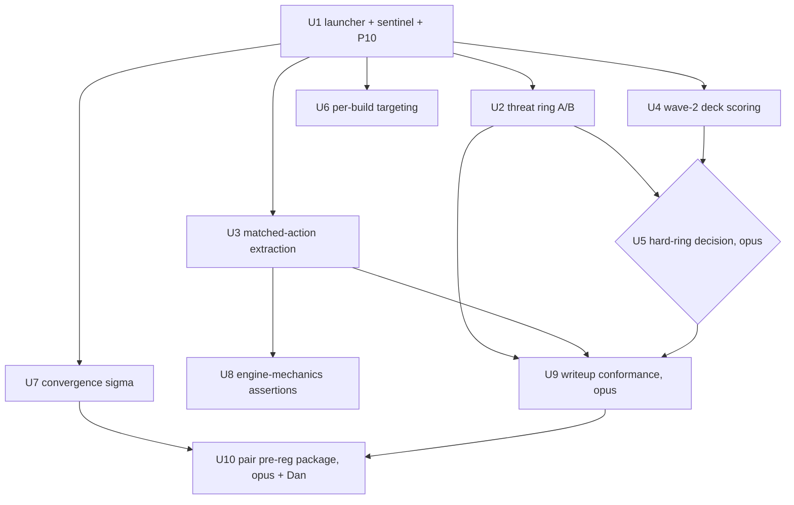

# feat: Post-audit improvement push with delegated unattended execution

## Summary

Execute the eight verified follow-ups from the 2026-07-08 audit as one unattended ce-work run in a dedicated tmux session, with per-unit model delegation (haiku mechanical, sonnet builds, opus judgment) while the existing Haiku autoloop is held to maintenance-only. The push banks the un-broken threat-retreat lever, replaces the unsound expert-lookup with matched-action extraction, fixes loss targeting, scores deck wave 2, and lands the endgame ops chain on its roadmap dates.

## Problem Frame

The 33-agent audit (findings.md section 4D, 2026-07-08 entry) established that the project's improvement engine was misfiring: its best remaining lever was closed by a measurement bug, its expert-data analysis was unsound, its loss targeting reads a mixed-generation pool, and ~90% of loop iterations produced nothing durable. The fixes are known and verified; what remains is executing them with the right model for each job and without a fifth concurrent-write incident. Deadlines bound the work: pair pre-registration by Aug 5, submission lock Aug 12-13, writeup submitted by Sep 1.

---

## Requirements

**Measurement levers**
- R1. PTCG_THREAT_RETREAT has a ring verdict: a same-run A/B on the calibrated ring, n=100/arm, on the yushin deck, gated at more than +5pp, with the verdict and its saturation context recorded.
- R2. Matched-action extraction replaces the unsound U106 verdicts: for our matched loss states, the expert's actual per-decision actions are extracted from the episode zips and reported per loss cluster with support counts.
- R3. The five wave-2 deck candidates have ring scores against a yushin baseline, with promote/no-promote verdicts at the pre-registered margin.

**Instrumentation and governance**
- R4. The loop's "Top loss bucket" targeting reflects the live shipped refs only, with the mixed pool demoted to a secondary line.
- R5. The hard-ring question is decided (build or explicitly not needed) from this push's own gate data, not speculation.
- R6. Convergence residual sigma is measured and documented, pricing the Aug pair decision.
- R7. The pair pre-registration package (E[max] arithmetic, draft JSON row, lock-rehearsal checklist) exists by Aug 5 for Dan to sign.

**Hardening and writeup**
- R8. All 21 engine-mechanics tests assert real values from real cg.api game states; no silent early-return can produce a false pass.
- R9. The writeup stays inside the 1900-1990 word freeze band and folds in the instrument lesson, the oracle-bound closure, and the corrected U106 arc, with the machine-audited claims ledger extended to the new citations.

**Execution safety**
- R10. The push runs unattended in its own tmux session with per-unit model delegation, and the autoloop is mechanically restricted to maintenance-only for the duration; no unit writes files owned by another concurrent process.

---

## Key Technical Decisions

- **Sonnet orchestrates, models delegate per unit.** The ce-work session runs on sonnet; each unit carries a Delegation field the orchestrator passes to its subagent dispatch. Opus is reserved for the three judgment units (U5, U9, U10); haiku takes only exactly-specified mechanical work. Rationale: opus end-to-end costs more without improving mechanical units; haiku unsupervised on judgment work produced the churn quantified in findings.md 4D.
- **Sentinel-file restriction, not autoloop shutdown.** run_cework.sh creates `.cework_active` at start and removes it at exit; LOOP_BRIEF.md P10 instructs the autoloop to do maintenance-only iterations (board checks, daily refresh) while the sentinel exists. Rationale: keeps refresh automation alive while removing the file-collision surface that caused four regeneration losses plus the 2026-07-08 working-tree wipe.
- **U105b runs on the standard ring with saturation routing.** The hard ring does not exist; the standard ring saturates near 0.875-0.91 and the off-arm (yushin+ability) last read 0.850-0.875. If the off-arm reads at or above 0.85, the verdict routes to U5 rather than being declared FAIL on a compressed delta. Loss rate against the hardest three clones is recorded as a secondary metric in the same run.
- **Wave-2 scoring bypasses the stock CLI.** `tools/score_candidate_decks.py` hardcodes a trolley baseline and would score all 40 candidate CSVs; the wave-2 runner builds its own builds dict (yushin baseline plus the wave-2 stems) and calls `run_ring` directly. Rationale: repo research verified the stock tool cannot express this comparison.
- **Matched-action extraction joins across all episode zips.** Corpus game_ids lag zip dates by about one day, so the join searches every zip's member index, not the same-day zip. Neighbor keys are retained in the kNN join; expert actions come from the existing `move_rows_from_replay` machinery via a thin zip-reader adapter.
- **Pre-registrations and live-ref lists are written only through the JSON STATE block** via `tools/loop_state.py`'s canonical writer. Hand-edited prose has been silently destroyed four times; prose is a rendered view.
- **Gates settle at n=100 on the first try.** n=40 ring reads are 1-sigma; U104's +15pp shrank to a failing +9pp at n=100. Screening may run at n=40, but no promote/close decision lands on it.

---

## High-Level Technical Design

File-ownership partition while the push runs:

| Owner | Files |
|---|---|
| ce-work units | tools/threat_retreat_ring_check.py, analysis/matched_action_extraction.py, tools/score_wave2_candidates.py, tools/convergence_sigma.py, tests/test_engine_mechanics.py, docs/writeup/*, new analysis/*.md, run_cework.sh |
| autoloop (maintenance-only) | state/current.md regeneration, data/leaderboard_cache/*, autoloop_status.md |
| shared, canonical-writer only | state/current.md JSON STATE block (U6 and U10 write through tools/loop_state.py, never by hand) |
| Dan | Kaggle submissions, the Rules 2.2.b screenshot check, pair pre-registration sign-off |

---

## Implementation Units

### U1. Launcher, sentinel, and autoloop restriction

- **Goal:** The push can run unattended in tmux without colliding with the autoloop.
- **Requirements:** R10
- **Dependencies:** none
- **Delegation:** sonnet
- **Files:** run_cework.sh (create), LOOP_BRIEF.md (append P10 block), docs/plans/2026-07-10-001-feat-improvement-push-plan.md (this plan, read-only input)
- **Approach:** Mirror run_autoloop.sh: full claude path, stdin-piped prompt (`cat <prompt file> | claude -p --model claude-sonnet-5 --dangerously-skip-permissions`), MSYS_NO_PATHCONV=1, PYTHONIOENCODING=utf-8, own tmux session name (ptcgwork) and log (cework.log), touch `.cework_active` on start and remove on exit via trap, restart-on-nonzero-exit up to 3 attempts (ce-work resumes from git state). The prompt file instructs the orchestrator to execute this plan via ce-work, honoring each unit's Delegation field through subagent model overrides, committing only its own unit's files, and never discarding foreign working-tree changes. P10 block: while `.cework_active` exists the autoloop does only board checks and daily refresh, and never touches docs/writeup/ or files named in this plan.
- **Patterns to follow:** run_autoloop.sh (stdin pipe, iteration counter, backoff), watchdog_check.sh (session liveness checks).
- **Test scenarios:** Test expectation: none, shell launcher and doc edit; verified by launch behavior (sentinel appears, log accumulates, session survives a simulated nonzero exit).
- **Verification:** tmux session ptcgwork running the orchestrator; `.cework_active` present; autoloop's next iterations show maintenance-only behavior in autoloop_status.md.

### U2. Threat-retreat ring A/B (U105b)

- **Goal:** A ring verdict for PTCG_THREAT_RETREAT on the yushin deck.
- **Requirements:** R1
- **Dependencies:** U1
- **Delegation:** sonnet builds and runs; opus writes the verdict
- **Files:** tools/threat_retreat_ring_check.py (create), tests/test_threat_retreat_ring_check.py (create), analysis/u105b_threat_retreat_ring_ab.md (create)
- **Approach:** Mirror tools/ability_ring_check.py's monkeypatch-wrapper pattern combined with tools/stacked_ring_u104.py's `_make_agent_factory` (deck pinning plus multi-flag patching, adding `_THREAT_RETREAT`). Two arms, both yushin+ability, threat off vs on, n=100/arm, same-run, alternating seats. Record loss rate vs the three hardest clones as a secondary metric. Gate: more than +5pp same-run. Saturation routing per KTD: off-arm at or above 0.85 sends the verdict to U5 instead of a bare FAIL.
- **Patterns to follow:** tools/ability_ring_check.py, tools/attack_first_ring_check.py (GATE_MARGIN_PP, diff_pp output), tools/stacked_ring_u104.py.
- **Test scenarios:** flag-patching wrapper restores prior flag state after each call (happy path); factory produces distinct agents per arm (off-arm never sees `_THREAT_RETREAT=True`); gate math: diff exactly +5.0pp is FAIL, +5.1pp is PASS; secondary loss-rate metric counts only the named hardest clones; n and W-D-L totals reconcile per arm.
- **Verification:** analysis doc records both arms' W-D-L at n=100, the delta, the gate verdict or the saturation escalation, and the secondary metric; full suite green.

### U3. Matched-action extraction (U106b)

- **Goal:** Expert per-decision actions at our matched loss states, replacing the unsound distance-only verdicts.
- **Requirements:** R2
- **Dependencies:** U1
- **Delegation:** sonnet
- **Files:** analysis/matched_action_extraction.py (create), analysis/matched_expert_actions.md (create), tests/test_matched_action_extraction.py (create)
- **Approach:** Extend the kNN join to retain neighbor identity (expert game_id, seat, turn). Resolve each neighbor's episode JSON by searching all data/episodes zip member indexes (one-day offset; build a stem-to-zip index once). Extract the expert's chosen MAIN action at the matched turn via tools/replays_to_rows.py's `move_rows_from_replay` behind a zip-reader adapter. Aggregate expert action types per loss cluster, weighted per game, with neighbor-distance support reported alongside. Scope note: first pass reports expert action distributions only; our own actions at those states are unlogged (recorded limitation, not silently skipped). Interpret under the deck-blind feature caveat carried from the audit.
- **Patterns to follow:** analysis/state_matched_expert_lookup.py (join scaffolding, corrected per LOOP_BRIEF P9 rule 4), tools/replays_to_rows.py, agents/imitation_features.py.
- **Test scenarios:** neighbor keys survive the join (fixture with known nearest neighbor); zip index maps a corpus game_id found only in the prior day's zip; action extraction returns the recorded `entry["action"]` index for a fixture replay; per-game weighting: a game contributing 50 states does not dominate a cluster 50:1; empty-support cluster reports support=0 instead of fabricating a verdict.
- **Verification:** analysis doc reports, per loss cluster: matched expert action distribution, support, mean distance; findings entry cites it; full suite green.

### U4. Wave-2 deck candidate scoring (U39 wave 2)

- **Goal:** Ring verdicts for the wave-2 candidates against the current best deck.
- **Requirements:** R3
- **Dependencies:** U1
- **Delegation:** sonnet
- **Files:** tools/score_wave2_candidates.py (create), analysis/wave2_ring_scores.md (create), tests/test_score_wave2_candidates.py (create)
- **Approach:** Custom builds dict: baseline `deck:candidate_yushin_ito` plus the wave-2 stems present on disk (third_ptcg_club, kashiwashira, zoroark190, bluezlee); the fifth (a non-ASCII-named deck) has no CSV on disk, so regenerate it via tools/dedupe_mined_candidates.py if the mined source still yields it, else record the gap. Screen at n=40; any candidate clearing +0.10 over yushin re-runs at n=100 in the same tool before any promote verdict. Reuse `promote_verdicts(results, baseline="candidate_yushin_ito")`.
- **Patterns to follow:** tools/score_candidate_decks.py (verdict math, float tolerance), tools/ring_calibrate.py run_ring.
- **Test scenarios:** builds dict contains only the yushin baseline plus wave-2 stems, never the full 40-candidate pool; missing-CSV stem is skipped with a recorded reason, not a crash; screen-then-confirm flow only confirms candidates that cleared the screen; promote verdict at exactly +0.10 uses the established inclusive tolerance.
- **Verification:** analysis doc with per-candidate W-D-L, deltas vs yushin, verdicts, and the fifth-deck disposition; full suite green.

### U5. Hard-ring decision (U110)

- **Goal:** Build the hard ring or close the question with evidence.
- **Requirements:** R5
- **Dependencies:** U2, U4
- **Delegation:** opus
- **Files:** analysis/u110_hard_ring_decision.md (create); if BUILD: tools/hard_ring.py (create), tests/test_hard_ring.py (create)
- **Approach:** Decision input: did any gate in U2/U4 actually saturate (off-arm at or above 0.85 with a compressed delta)? If no gate needed resolution above 0.875, close U110 as not needed now with the trigger condition recorded. If yes, build the enriched arm (hardest clones plus 800+-rated harvested decks piloted by the stacked build) and re-run the saturated comparison on it; the hard ring earns gate authority only by correctly ordering builds the standard ring already orders.
- **Patterns to follow:** tools/ring_calibrate.py calibration math (Kendall tau, ordering checks), the U73-to-U81 opponent-pool correction arc in docs/writeup/offline_ladder_transfer.md.
- **Test scenarios:** if BUILD: hard-ring opponent list excludes any clone piloting the build-under-test's own deck (the U73 mirror-drag bug); ordering check reproduces the standard ring's ordering on two known builds before any new gate uses it. If NOT built: test expectation: none, decision doc only.
- **Verification:** decision doc states the verdict, the evidence, and the re-open trigger; any new gate authority is earned per the ordering check.

### U6. Per-build loss targeting (U107b)

- **Goal:** Iteration targeting reads the shipped builds' losses, not the mixed pool.
- **Requirements:** R4
- **Dependencies:** U1
- **Delegation:** sonnet
- **Files:** tools/loop_state.py (modify), tools/daily_refresh.py (modify), tests/test_per_build_targeting.py (create)
- **Approach:** Add a `live_refs` array to the JSON STATE block (written once via the canonical writer, seeded with the two live refs); `refresh_loss_distribution` passes it as ref_filter and renders the per-build table as the primary "Top loss bucket", with the pool-wide distribution demoted to a secondary line. Falls back to pool-wide when `live_refs` is absent or the manifest lacks coverage, with the fallback stated in the rendered output. Coordinate with the autoloop: this unit lands while the sentinel restricts the loop, and the loop picks the change up on its next refresh.
- **Patterns to follow:** tools/loop_state.py classify_dirs_per_build and ref_filter plumbing (already present), analysis/u107_per_build_loss_ledger.py.
- **Test scenarios:** live_refs present routes targeting to filtered counts (fixture manifest); absent live_refs falls back with an explicit marker; a ref missing from the manifest contributes zero rather than crashing; rendered current.md keeps the JSON block as source of truth (round-trip through the writer preserves pre_registrations).
- **Verification:** after the next daily refresh, current.md's top loss bucket is per-build with the pool-wide line secondary; existing network-dependent tools/test_u107_filtering.py left as is; new unit tests are hermetic and green.

### U7. Convergence residual sigma (U115)

- **Goal:** The number that prices the identical-vs-hedge pair decision.
- **Requirements:** R6
- **Dependencies:** U1
- **Delegation:** sonnet
- **Files:** tools/convergence_sigma.py (create), analysis/convergence_sigma.md (create), tests/test_convergence_sigma.py (create)
- **Approach:** Fit rating-read spread against episode count from the ledger's 77 repeated board reads plus the age-stratified refit machinery; the 3-snapshot drift log is insufficient alone (repo research). Output: residual sigma estimate after a 200-350 game convergence window with a CI, surviving the fresh-read-depression correction from the aged-reads work.
- **Patterns to follow:** tools/refit_noise_model_age_stratified.py, analysis/age_stratified_refit_findings.md.
- **Test scenarios:** estimator reproduces a known sigma on synthetic reads with injected noise; age-stratification excludes sub-48h reads from the terminal estimate; output includes n, sigma, CI, and the episode-count curve points.
- **Verification:** analysis doc with the sigma-vs-episodes curve and a stated end-of-window residual sigma; cited by U10.

### U8. Engine-mechanics hard assertions (U100)

- **Goal:** The 21 mechanics tests assert real engine values; silent early-returns cannot fake a pass.
- **Requirements:** R8
- **Dependencies:** U1 (parallel-safe with U2-U7)
- **Delegation:** sonnet
- **Execution note:** characterization-first; the engine's actual behavior is the spec, probe before asserting.
- **Files:** tests/test_engine_mechanics.py (modify), tests/engine_state_driver.py (create if the driver outgrows the test file)
- **Approach:** The existing tests are tolerant probes built on the file's GameState wrapper (take_option/take_first_option over search_step) that silently `return` when a needed option never appears. The work: build a state driver that plays toward each mechanic's precondition (choosing options by predicate, not blindly first-legal), replace every silent early-return with either a hard assertion or `pytest.skip` carrying the reason, and assert concrete values (damage after weakness, prize count transitions, energy gating) probed from the live engine. Import cg canonically per the file's module-identity warning; never import data.cg.
- **Patterns to follow:** the file's own GameState/_setup_fresh_game scaffolding; tools/fuzz_invariants.py's calibrate-then-enforce discipline for anything distribution-dependent.
- **Test scenarios:** the 21 tests themselves are the deliverable; meta-scenarios: no test body contains a bare silent return path (grep-checkable); a deliberately broken assertion fails the suite (mutation sanity check on two tests); suite runtime stays under a few minutes (drive states, do not brute-force long games).
- **Verification:** all 21 pass with real assertions; docs/rules_as_implemented.md updated where probed behavior contradicts its prose; LOOP_BRIEF's U100 status check paragraph updated to DONE.

### U9. Writeup conformance (toward Sep 1)

- **Goal:** The writeup carries the new arcs, stays in the freeze band, and every claim is machine-audited.
- **Requirements:** R9
- **Dependencies:** U2, U3, U5
- **Delegation:** opus
- **Files:** docs/writeup/final_synthesis.md (modify), docs/writeup/offline_ladder_transfer.md (consistency pass), tests/test_comprehension_writeup.py (extend claims ledger)
- **Approach:** Fold in: the instrument lesson (a fires-vs-inert gate needs a positive control; the U105 bug arc), the oracle-bound closure (search lane), and the corrected U106-to-matched-action arc. Hold final_synthesis.md at 1900-1990 words; 2000 is a ceiling, never a target. Extend the claims-ledger test so each newly cited analysis path must exist. The autoloop stays banned from these files per P10.
- **Patterns to follow:** the existing machine-audited claims ledger in tests/test_comprehension_writeup.py; the honest-negative narrative shape of docs/writeup/offline_ladder_transfer.md.
- **Test scenarios:** claims-ledger test fails when a cited path is removed (fixture check); word count in band asserted by test; no em or en dash characters anywhere in the writeup files (asserted).
- **Verification:** word count in band; extended ledger green; the three arcs present and internally consistent with findings.md.

### U10. Pair pre-registration and lock-rehearsal package (U116 + U117)

- **Goal:** Everything Dan needs to sign the Aug pair decision, ready by Aug 5.
- **Requirements:** R7
- **Dependencies:** U7; U2/U4/U5 verdicts as available
- **Delegation:** opus for the arithmetic; haiku for the checklist; Dan signs
- **Files:** analysis/pair_preregistration_prep.md (create), docs/lock_rehearsal_checklist.md (create), state/current.md JSON STATE block (draft row via canonical writer, marked DRAFT)
- **Approach:** E[max] arithmetic per analysis/final_scoring_semantics.md: two copies of the strongest build by default; a hedge only if the runner-up's ring CI overlaps the leader's and U7's residual sigma makes E[max of two different builds] beat E[best single]. Inputs: ring shortlist from U2/U4/U5, U7 sigma, and the Rules 2.2.b answer (DAN-1, still open; the package states both branches if unanswered). Checklist: minute-by-minute Aug 12-13 procedure, grader-test-before-upload, confirm-COMPLETE-before-next-roll, quota plan, U108 standing rule. The draft pre-registration row is written through the canonical writer and marked DRAFT; only Dan's confirmation finalizes it.
- **Patterns to follow:** state/current.md pre_registrations schema (validate_prereg), P3 ops guards in LOOP_BRIEF.md.
- **Test scenarios:** draft row passes validate_prereg; E[max] arithmetic reproduces a hand-computed example for both the identical and hedge branches; checklist paths referenced all exist (ledger-style test).
- **Verification:** package committed by Aug 5; Dan pinged with the sign-off ask and the open DAN-1 item.

---

## Scope Boundaries

- U102 (card-text differential audit) and U103 (mirror benchmark) stay out of this push; they remain roadmap week-2-3 items for a later slot.
- No closed lever reopens without its recorded re-test condition: the search lane (oracle-bound, delta +0.000), PRIZE_CLOSE as written, bench_dig, energy_seq, CEM conditions a/b/c, whole-meta-deck copying, deck basics/energy sweeps, move-level blunder mining as originally proposed.
- No new ladder submissions inside this push; both slots are occupied and P3 governance plus the daily quota belong to Dan.
- No autoloop redesign beyond the P10 maintenance restriction.

### Deferred to Follow-Up Work

- Hard-ring full calibration against ladder truth (only the ordering check lands in U5 if built).
- Logging our own per-decision actions at loss states (unblocks expert-vs-us action deltas in a U106c).
- The HOLD sentinel for the autoloop launcher (stop invoking the model when the queue is empty), noted in the audit as a cost fix.

---

## Risks & Dependencies

- Ring saturation can mute U2 and U4 gates; mitigated by the secondary loss-rate metric and U5's routing.
- The autoloop writes state/current.md concurrently; mitigated by the sentinel restriction, canonical-writer-only JSON edits, and per-unit file ownership. Any unexpected working-tree modification is foreign and must be left alone.
- n=100 ring runs are hours of compute; the orchestrator launches them in their own tmux windows and polls rather than blocking an LLM context.
- The commit-msg hook rejects em/en dashes; units reword rather than bypass, and never use --no-verify.
- U8 depends on the engine singleton behaving under repeated search_begin/search_end cycles; if the harness hits native-state corruption, the unit narrows to the mechanics reachable per process and documents the constraint.
- Kaggle quota, submissions, and the Rules 2.2.b answer are Dan-owned dependencies; U10 proceeds to a two-branch package if 2.2.b stays unanswered.
